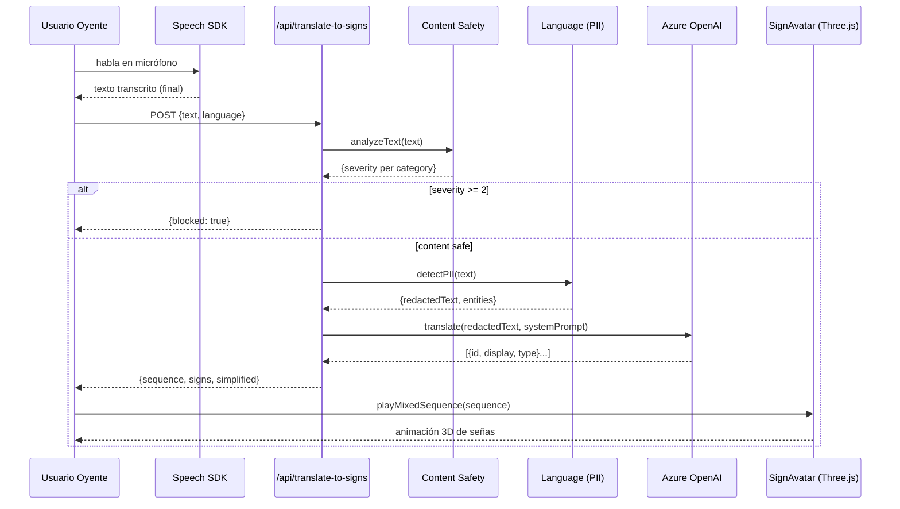
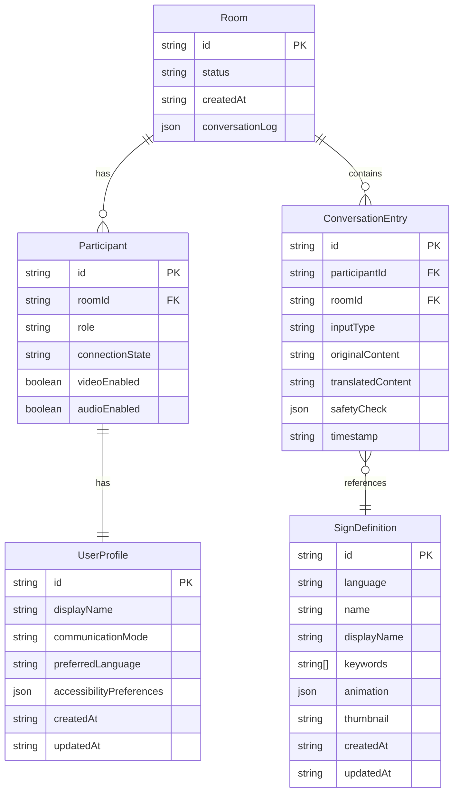

# Azure SignBridge Multimodal — Documentación Exhaustiva

> Actualizado el 2026-03-26. Documenta el estado real del código; las secciones marcadas como **[STUB]** corresponden a módulos con esqueleto definido pero sin implementación funcional.

---

## Tabla de Contenidos

1. [Visión General del Proyecto](#1-visión-general-del-proyecto)
2. [Arquitectura del Sistema](#2-arquitectura-del-sistema)
3. [Estructura de Archivos](#3-estructura-de-archivos)
4. [Módulos y Componentes](#4-módulos-y-componentes)
5. [Modelos de Datos](#5-modelos-de-datos)
6. [API / Endpoints](#6-api--endpoints)
7. [Requisitos y Dependencias](#7-requisitos-y-dependencias)
8. [Instalación y Configuración](#8-instalación-y-configuración)
9. [Comandos Disponibles](#9-comandos-disponibles)
10. [Casos de Uso Principales](#10-casos-de-uso-principales)
11. [Testing](#11-testing)
12. [Deploy y CI/CD](#12-deploy-y-cicd)
13. [Convenciones y Estándares](#13-convenciones-y-estándares)
14. [Problemas Conocidos y Deuda Técnica](#14-problemas-conocidos-y-deuda-técnica)

---

## 1. Visión General del Proyecto

### Nombre
**Azure SignBridge Multimodal**

### Propósito
Plataforma de comunicación en tiempo real que elimina la barrera entre personas sordas (usuarios de lengua de señas) y oyentes (usuarios de habla), permitiendo que ambos se comuniquen en su modalidad nativa dentro de una videollamada.

### Problema que resuelve
Las personas sordas o con discapacidad auditiva no pueden participar en video-reuniones sin intérprete humano. SignBridge actúa como intérprete automático bidireccional:

- **Habla → Señas:** convierte el audio del hablante en texto (Azure Speech) y luego mueve un avatar 3D que ejecuta las señas correspondientes en ASL o LSC.
- **Señas → Texto:** usa la cámara del usuario sordo para detectar manos con MediaPipe, clasifica la seña y muestra subtítulos en tiempo real.
- **Accesibilidad radical:** todo el pipeline respeta WCAG 2.1 AA; incluye modo alto contraste, tamaño de fuente, reducción de movimiento y configuración de posición de subtítulos.

### Stack tecnológico completo

| Capa | Tecnología | Versión |
|---|---|---|
| Framework Web | Next.js | 16.2.1 (App Router) |
| UI | React | 18 |
| Lenguaje | TypeScript | 5 |
| Estilos | Tailwind CSS | 3 |
| Animaciones UI | Framer Motion | — |
| 3D / Avatar | Three.js | — |
| Seguimiento de manos | MediaPipe Hands | 0.4 (CDN) |
| Lenguaje de señas | Ready Player Me GLB | — |
| IA / LLM | Azure OpenAI (GPT-4o) | API 2024-10-01-preview |
| Voz | Azure Speech SDK | — |
| Traducción | Azure Translator | [STUB] |
| Visión por computadora | Azure Computer Vision | [STUB] |
| Seguridad de contenido | Azure AI Content Safety | — |
| Detección de PII | Azure AI Language | — |
| Videollamadas | Azure Communication Services | — |
| Tiempo real | Azure SignalR Service | [STUB integración] |
| Base de datos | Azure Cosmos DB (Core SQL) | — |
| Almacenamiento | Azure Blob Storage | — |
| Monitoreo | Azure Application Insights | — |
| Infra como código | Azure Bicep | — |
| Contenerización | Docker (Alpine Linux) | Node 20 Alpine |
| Runtime | Node.js | ≥ 20 |
| Gestor de paquetes | npm | ≥ 10 |

---

## 2. Arquitectura del Sistema

### Patrón arquitectónico
**Monolito modular con App Router de Next.js.** La aplicación combina:
- **SSR / API Routes** para operaciones de servidor (autenticación, integración Azure, base de datos).
- **SPA rich-client** para la sala de reunión (hooks de tiempo real, MediaPipe, Three.js).
- **Agents-ready layer** — estructura de agentes de IA orquestados lista para extenderse (actualmente en esqueleto).

### Diagrama de arquitectura

```mermaid
graph TB
    subgraph Browser["Navegador del Usuario"]
        direction TB
        RoomPage["Room Page\n(app/room/[id])"]
        AvatarComp["SignAvatar\n(Three.js GLB)"]
        MediaPipe["MediaPipe Hands\n(WASM CDN)"]
        SpeechSDK["Azure Speech SDK\n(dynamic import)"]
        ACSClient["ACS Calling SDK\n(video/audio)"]
        SignalRClient["SignalR Client\n[STUB]"]
    end

    subgraph NextAPI["Next.js API Routes (Servidor)"]
        direction TB
        SpeechRoute["/api/speech\n(token vending)"]
        SignsRoute["/api/signs\n(CRUD)"]
        TranslateRoute["/api/translate-to-signs\n(GPT-4o pipeline)"]
        SummaryRoute["/api/summary\n(GPT-4o)"]
        RoomsRoute["/api/rooms/join\n(ACS token)"]
        SafetyRoute["/api/safety [STUB]"]
        SignRoute["/api/sign [STUB]"]
        TranslatorRoute["/api/translate [STUB]"]
        ProfileRoute["/api/profile [STUB]"]
    end

    subgraph AzureServices["Azure Services"]
        direction TB
        OpenAI["Azure OpenAI\n(GPT-4o)"]
        Speech["Azure Speech\n(STT + token)"]
        Cosmos["Azure Cosmos DB\n(signs container)"]
        ACSServer["Azure Communication\nServices"]
        SignalR["Azure SignalR\n[STUB]"]
        ContentSafety["Azure Content Safety"]
        Language["Azure Language\n(PII Detection)"]
        Translator["Azure Translator\n[STUB]"]
        Vision["Azure Computer Vision\n[STUB]"]
        Blob["Azure Blob Storage"]
        AppInsights["Application Insights"]
    end

    RoomPage --> SpeechSDK
    RoomPage --> MediaPipe
    RoomPage --> AvatarComp
    RoomPage --> ACSClient
    RoomPage --> SignalRClient

    SpeechSDK -->|"GET /api/speech"| SpeechRoute
    SpeechRoute --> Speech
    RoomPage -->|"POST /api/translate-to-signs"| TranslateRoute
    TranslateRoute --> ContentSafety
    TranslateRoute --> Language
    TranslateRoute --> OpenAI
    RoomPage -->|"POST /api/summary"| SummaryRoute
    SummaryRoute --> OpenAI
    RoomPage -->|"POST /api/rooms/join"| RoomsRoute
    RoomsRoute --> ACSServer
    ACSClient -->|"WebRTC"| ACSServer
    SignalRClient -->|"WebSocket"| SignalR
    SignsRoute --> Cosmos
    AppInsights -.->|"telemetry"| NextAPI
```



### Flujo de datos — Caso habla → seña



### Capas del sistema

| Capa | Archivos | Responsabilidad |
|---|---|---|
| **Presentación** | `app/**`, `components/**` | UI, layout, routing Next.js |
| **Hooks** | `hooks/**` | Estado y efectos de cliente (media, llamadas, speech) |
| **API Routes** | `app/api/**` | Endpoints HTTP server-side, integración Azure |
| **Lib / Azure** | `lib/azure/**` | Clientes y adaptadores de cada servicio Azure |
| **Lib / Avatar** | `lib/avatar/**` | Motor 3D, keyframes ASL/LSC, carga de animaciones |
| **Lib / MediaPipe** | `lib/mediapipe/**` | Seguimiento de manos y clasificación de señas |
| **Lib / Agents** | `lib/agents/**` | Orquestación IA (esqueleto, no funcional) |
| **Tipos** | `types/index.ts` | Contratos TypeScript compartidos |
| **Scripts** | `scripts/**` | CLI: verificación, seed, descarga de assets |
| **Infraestructura** | `infrastructure/**` | IaC Bicep para aprovisionamiento Azure |

---

## 3. Estructura de Archivos

```
Azure-SignBridge-Multimodal/
│
├── .eslintrc.json               # ESLint: reglas Next.js + TypeScript
├── .gitignore                   # Exclusiones estándar Next.js
├── Dockerfile                   # Imagen producción: Node 20 Alpine, usuario no-root
├── next.config.mjs              # Next.js: standalone build, security headers
├── package.json                 # Dependencias + scripts npm
├── package-lock.json            # Lock de dependencias
├── postcss.config.mjs           # PostCSS con plugin Tailwind
├── tailwind.config.ts           # Tailwind CSS con colores brand
├── tsconfig.json                # TypeScript strict mode, alias @/*→src/*
├── README.md                    # Placeholder genérico Next.js
├── DOCUMENTATION.md             # Este documento
│
├── public/
│   └── models/avatar/
│       └── avatar.glb           # Modelo 3D Ready Player Me (avatar humanoide)
│
├── src/
│   ├── app/                     # Next.js App Router
│   │   ├── layout.tsx           # Layout raíz: fuente Inter, metadatos globales
│   │   ├── page.tsx             # Landing page: hero, features grid, CTA
│   │   ├── globals.css          # Variables CSS, reset global, Tailwind base
│   │   ├── favicon.ico
│   │   │
│   │   ├── api/                 # API Routes (server-side)
│   │   │   ├── speech/
│   │   │   │   └── route.ts     # GET: genera token Azure Speech (9 min TTL)
│   │   │   ├── signs/
│   │   │   │   ├── route.ts     # GET lista señas / POST crea seña (Cosmos DB)
│   │   │   │   └── [id]/
│   │   │   │       └── route.ts # GET/PUT/DELETE una seña; POST duplica a otro idioma
│   │   │   ├── sign/
│   │   │   │   └── route.ts     # POST: reconocimiento de seña desde landmarks [STUB]
│   │   │   ├── translate/
│   │   │   │   └── route.ts     # POST: traducción Azure Translator [STUB]
│   │   │   ├── translate-to-signs/
│   │   │   │   └── route.ts     # POST: texto → secuencia de señas vía GPT-4o + safety
│   │   │   ├── safety/
│   │   │   │   └── route.ts     # POST: análisis content safety [STUB]
│   │   │   ├── summary/
│   │   │   │   └── route.ts     # POST: resumen de reunión vía GPT-4o
│   │   │   ├── profile/
│   │   │   │   └── route.ts     # GET/PUT: perfil de accesibilidad del usuario [STUB]
│   │   │   └── rooms/
│   │   │       └── join/
│   │   │           └── route.ts # POST: crea usuario ACS y devuelve token VoIP
│   │   │
│   │   ├── room/
│   │   │   ├── new/
│   │   │   │   └── page.tsx     # Redirect: genera UUID y redirige a /room/<uuid>
│   │   │   └── [id]/
│   │   │       └── page.tsx     # Sala de reunión principal (componente principal)
│   │   │
│   │   ├── admin/
│   │   │   └── signs/
│   │   │       └── page.tsx     # Admin CRUD de señas (gestión base de datos)
│   │   │
│   │   └── test/                # Páginas de prueba manual (no son tests automatizados)
│   │       ├── avatar/page.tsx           # Test render de avatar
│   │       ├── avatar-debug/page.tsx     # Debug de huesos y animaciones
│   │       ├── avatar-calibrate/page.tsx # Calibración de poses
│   │       ├── sign/page.tsx             # Test de reconocimiento de señas
│   │       └── speech/page.tsx           # Test de reconocimiento de voz
│   │
│   ├── components/              # React Client Components
│   │   ├── SignAvatar.tsx        # Wrapper del avatar 3D: loading, error, label animado
│   │   ├── VideoStream.tsx       # Renderizado de stream de video ACS
│   │   ├── TranscriptionOverlay.tsx  # Overlay de subtítulos en tiempo real
│   │   ├── ChatPanel.tsx         # Panel de historial de mensajes
│   │   ├── OnboardingModal.tsx   # Modal de selección de modo de comunicación
│   │   ├── SessionSummary.tsx    # Resumen al finalizar sesión
│   │   ├── MeetingSummary.tsx    # Visualización del resumen GPT-4o
│   │   ├── ResponsibleAIPanel.tsx # Panel de transparencia IA (métricas)
│   │   ├── AccessibilityPanel.tsx # Panel de configuración de accesibilidad
│   │   ├── SignRecognizer.tsx    # Overlay de visualización de detección de manos
│   │   └── admin/
│   │       └── PhotoCalibrator.tsx  # Herramienta de calibración de poses del avatar
│   │
│   ├── hooks/                   # Custom React Hooks (cliente)
│   │   ├── useSpeechRecognition.ts  # Azure Speech: reconocimiento continuo
│   │   ├── useSignRecognition.ts    # MediaPipe + clasificación de señas
│   │   ├── useAcsCalling.ts         # Azure ACS: videollamada grupal
│   │   ├── useAccessibility.ts      # Perfil de accesibilidad del usuario [STUB]
│   │   └── useSignalR.ts            # Conexión SignalR Hub [STUB]
│   │
│   ├── lib/                     # Lógica de negocio sin React
│   │   ├── azure/               # Clientes de servicios Azure
│   │   │   ├── openai.ts        # Factory del cliente AzureOpenAI
│   │   │   ├── speech.ts        # Builder del recognizer + tipos de token
│   │   │   ├── translator.ts    # Cliente Azure Translator [STUB]
│   │   │   ├── vision.ts        # Cliente Computer Vision [STUB]
│   │   │   ├── content-safety.ts # Análisis de texto (4 categorías, umbral severity ≥ 2)
│   │   │   ├── pii-detection.ts # Detección y redacción de PII (API v3.1)
│   │   │   ├── cosmos.ts        # Singleton cliente Cosmos DB
│   │   │   ├── signs-db.ts      # CRUD de señas: getAllSigns, getSign, createSign, etc.
│   │   │   ├── communication.ts # Inicialización ACS [STUB]
│   │   │   └── signalr.ts       # Negociación SignalR [STUB]
│   │   │
│   │   ├── mediapipe/           # Seguimiento de manos y reconocimiento
│   │   │   ├── hand-tracker.ts  # Carga MediaPipe desde CDN, dibuja esqueleto en canvas
│   │   │   └── sign-classifier.ts # Clasificación rule-based (13 formas de mano estáticas)
│   │   │
│   │   ├── avatar/              # Motor 3D de avatar y base de animaciones
│   │   │   ├── avatar-engine.ts      # Three.js: carga GLB, interpola keyframes, idle, blink
│   │   │   ├── sign-core.ts          # Tipos: FingerRotation, HandPose, ArmPose, AvatarKeyframe
│   │   │   ├── sign-animations.ts    # Barrel: exporta todas las animaciones + helpers
│   │   │   ├── sign-animations-asl.ts # 38+ señas ASL con keyframes completos (~38KB)
│   │   │   ├── sign-animations-lsc.ts # LSC (Lengua de Señas Colombiana): vocabulario + alfabeto completo
│   │   │   ├── sign-animations-lsb.ts # LSB (Língua Brasileira de Sinais): 73 señas + 26 letras + 98 mapeos
│   │   │   ├── sign-loader.ts        # Selector ASL / LSC / LSB según idioma de UI
│   │   │   ├── sign-languages.ts     # Mapeo idioma UI → lengua de señas (3 idiomas)
│   │   │   └── sign-db-loader.ts     # Cosmos DB SignDefinition → SignAnimation
│   │   │
│   │   └── agents/              # Orquestación IA (esqueleto, no funcional)
│   │       ├── orchestrator.ts  # Pipeline orientado a eventos [STUB]
│   │       ├── sign-agent.ts    # Landmarks → traducción [STUB]
│   │       ├── speech-agent.ts  # Audio → transcripción [STUB]
│   │       ├── safety-agent.ts  # Filtrado de contenido [STUB]
│   │       └── summary-agent.ts # Resumen de reunión [STUB]
│   │
│   └── types/
│       └── index.ts             # Registro central de tipos TypeScript (200+ líneas)
│
├── scripts/
│   ├── tsconfig.json            # TypeScript config para scripts (CommonJS)
│   ├── verify-azure.ts          # Health check de los 11 servicios Azure (500+ líneas)
│   ├── download-avatar.ts       # Descarga el modelo GLB desde CDN/API
│   ├── seed-signs.ts            # Puebla Cosmos DB con datos de señas iniciales
│   └── inspect-avatar.ts        # Inspecciona esqueleto del GLB (nombres de huesos)
│
└── infrastructure/
    ├── main.bicep               # IaC: definición de todos los recursos Azure (~1000 líneas)
    ├── parameters.dev.json      # Parámetros para ambiente de desarrollo
    ├── parameters.prod.json     # Parámetros para producción (mayor capacidad)
    ├── deploy.sh                # Script Bash: ejecuta az deployment group create
    └── deploy-app.sh            # Script Bash: despliega la aplicación al recurso
```

**Convención de nombres:**
- Archivos de componentes React: `PascalCase.tsx`
- Hooks: `useCamelCase.ts`
- Módulos de librería: `kebab-case.ts`
- Rutas API: carpetas kebab-case con `route.ts` dentro
- Scripts: `kebab-case.ts`

---

## 4. Módulos y Componentes

### 4.1 App Router (`src/app/`)

| Componente | Responsabilidad |
|---|---|
| `layout.tsx` | Provee fuente Inter, metadatos `<head>`, wrapper global |
| `page.tsx` | Landing page marketing con hero, cards de features y botón CTA |
| `room/new/page.tsx` | Genera UUID con `crypto.randomUUID()` y redirige a `/room/<uuid>` |
| `room/[id]/page.tsx` | Orquesta toda la sala: hooks, estado, layout de dos columnas, modales |
| `admin/signs/page.tsx` | CRUD de señas para administradores; usa `/api/signs` |
| `test/*/page.tsx` | Páginas de prueba manual aisladas para cada subsistema |

### 4.2 Componentes React (`src/components/`)

| Componente | Props clave | Responsabilidad |
|---|---|---|
| `SignAvatar` | `skinTone, speed, onSignStart, onSignEnd` | Wrapper del `AvatarEngine`; expone ref con métodos `playSign`, `playSequence`, `fingerspell`, `playMixedSequence`, `setSkinTone`, `setSpeed`, `setStaticPose` |
| `TranscriptionOverlay` | — | Muestra subtítulos en vivo (texto final + interim) encima del video |
| `ChatPanel` | — | Historial de `ConversationEntry[]` con íconos de tipo y estado de safety |
| `OnboardingModal` | — | Selección de modo (`speak` / `sign` / `text`) al entrar a sala |
| `SessionSummary` | — | Modal final con resumen GPT-4o, tópicos y action items |
| `MeetingSummary` | — | Card con summary, topics[] y actionItems[] |
| `ResponsibleAIPanel` | — | Muestra `ResponsibleAIMetrics`: checks, filtrados, PII redactados, score |
| `AccessibilityPanel` | — | Controles de alto contraste, tamaño fuente, posición de subtítulos, skin tone avatar |
| `VideoStream` | — | Renderiza `RemoteVideoStream` de ACS en un `<video>` element |
| `SignRecognizer` | — | Superpone canvas con esqueleto de mano sobre el feed de cámara |
| `admin/PhotoCalibrator` | — | Permite fijar poses estáticas del avatar para capturar keyframes |

**Dependencias entre componentes:**
- `room/[id]/page.tsx` importa y orquesta todos los demás componentes
- `SignAvatar` depende de `AvatarEngine` (importación dinámica)
- `SignRecognizer` depende de `hand-tracker.ts`

### 4.3 Custom Hooks (`src/hooks/`)

#### `useSpeechRecognition(language: string)`
- **Estado:** `isListening`, `isLoading`, `transcript`, `interimText`, `error`
- **Métodos:** `startListening()`, `stopListening()`, `clearTranscript()`
- **Flujo:** Obtiene token de `/api/speech` → importa Speech SDK dinámicamente → construye `SpeechRecognizer` → acumula texto final; muestra texto interim mientras el usuario habla → renueva token antes de expirar (cada 9 min)
- **Depende de:** `lib/azure/speech.ts`, `/api/speech`

#### `useSignRecognition()`
- **Estado:** `isDetecting`, `isLoading`, `currentSign`, `currentEmoji`, `confidence`, `handsDetected`, `fps`, `fingerState`, `error`
- **Métodos:** `start(videoEl, canvasEl)`, `stop()`
- **Flujo:** Carga MediaPipe desde CDN → procesa frames a 30 FPS → classifica forma de mano → debounce 500ms (seña debe mantenerse) → emite `currentSign`
- **Depende de:** `lib/mediapipe/hand-tracker.ts`, `lib/mediapipe/sign-classifier.ts`

#### `useAcsCalling(roomId, startCall, onMessageReceived)`
- **Estado:** `call`, `remoteStreams[]`, `localVideoStream`, `error`
- **Métodos:** `toggleMic(mute)`, `toggleCam(turnOff)`, `sendData(payload)`
- **Flujo:** Llama `/api/rooms/join` → inicializa `CallClient` + `DeviceManager` → se une al grupo con `groupId=roomId` → suscribe streams remotos → DataChannel (channelId: 100) para mensajes de datos
- **Depende de:** `@azure/communication-calling`, `/api/rooms/join`

#### `useAccessibility()` [STUB]
- **Estado:** `profile` (valores por defecto hardcodeados)
- **TODO:** Persistir en `/api/profile` (Cosmos DB)

#### `useSignalR(roomId)` [STUB]
- **Propósito:** Conexión SignalR para broadcast en tiempo real
- **TODO:** Implementar `HubConnectionBuilder`, suscribirse a eventos

### 4.4 Biblioteca Azure (`src/lib/azure/`)

| Módulo | Estado | Responsabilidad |
|---|---|---|
| `openai.ts` | ✅ | Factory `createOpenAIClient()` → `AzureOpenAI` con env vars |
| `speech.ts` | ✅ | `buildSpeechRecognizer(token, region, lang)` + tipos de token |
| `content-safety.ts` | ✅ | `analyzeTextSafety(text)` → categorías + severidad |
| `pii-detection.ts` | ✅ | `detectAndRedactPII(text, lang)` → texto redactado + entidades |
| `cosmos.ts` | ✅ | Singleton `CosmosClient` + referencias a DB/container |
| `signs-db.ts` | ✅ | CRUD completo sobre container `signs` |
| `communication.ts` | [STUB] | Inicialización ACS |
| `signalr.ts` | [STUB] | Negociación SignalR |
| `translator.ts` | [STUB] | Azure Translator |
| `vision.ts` | [STUB] | Azure Computer Vision |

### 4.5 Avatar Engine (`src/lib/avatar/`)

| Módulo | Responsabilidad |
|---|---|
| `avatar-engine.ts` | Motor Three.js: carga GLB, sistema de keyframes, idle breathing, blink, cola de reproducción |
| `sign-core.ts` | Tipos: `FingerRotation`, `HandPose`, `ArmPose`, `AvatarKeyframe`, `SignAnimation` |
| `sign-animations-asl.ts` | 38+ señas ASL con keyframes completos + mapa `WORD_TO_SIGN_ASL` |
| `sign-animations-lsc.ts` | LSC (Lengua de Señas Colombiana): vocabulario extendido + alfabeto completo (1736 líneas) |
| `sign-animations-lsb.ts` | LSB (Língua Brasileira de Sinais): 73 señas léxicas + 26 letras (letra_a…letra_z) + 98 mapeos `WORD_TO_SIGN_LSB` (1299 líneas) |
| `sign-animations.ts` | Barrel de exportaciones + helpers de interpolación |
| `sign-loader.ts` | Selecciona ASL / LSC / LSB según idioma de UI |
| `sign-languages.ts` | Mapeo: código de idioma UI → `SignLanguageCode` ("ASL" \| "LSC" \| "LSB") — en-US→ASL, es-CO→LSC, pt-BR→LSB, es-ES→ASL |
| `sign-db-loader.ts` | Convierte `SignDefinition` de Cosmos DB a `SignAnimation` |

**Capacidades del AvatarEngine:**
- Esqueleto: 4 huesos por brazo × 2 + 3 articulaciones × 5 dedos × 2 + columna + cabeza
- Interpolación suave entre keyframes con easing
- Retorno natural a reposo 500ms después de la última seña
- Micro-oscilación de dedos en reposo (efecto de vida)
- Respiración en reposo (oscilación leve de columna)
- Parpadeo via morph targets (`eyeBlinkLeft`, `eyeBlinkRight`)
- Cola de animaciones para encadenamiento fluido
- Multiplicador de velocidad (0.3×–3×)
- Tinte de color de piel (claro/medio/oscuro)

### 4.6 MediaPipe (`src/lib/mediapipe/`)

| Módulo | Responsabilidad |
|---|---|
| `hand-tracker.ts` | Carga MediaPipe Hands 0.4 desde CDN (WASM 8MB), dibuja esqueleto de 21 landmarks sobre canvas |
| `sign-classifier.ts` | Clasificación rule-based: detecta extensión de dedos → 13 formas estáticas de mano |

**Señas reconocidas:** Fist (puño), Thumbs Up, Peace/Victory, Open Hand (5), ILY, Point Up, y otras formas estáticas. Confidence: similitud de Hamming ≥ 80%.

---

## 5. Modelos de Datos

### 5.1 Cosmos DB — Container `signs`

```
Database: signbridge (configurable via AZURE_COSMOS_DATABASE)
Container: signs
Partition key: /language
```

**Documento `SignDefinition`:**
```typescript
{
  id: string,              // UUID auto-generado
  language: string,        // "ASL" | "LSC" — partition key
  name: string,            // Nombre de la seña (ej. "hello")
  displayName: string,     // Nombre para mostrar (ej. "Hello / Hola")
  keywords: string[],      // Para búsqueda (ej. ["hi", "greeting"])
  animation: {             // Keyframes completos de la animación
    keyframes: AvatarKeyframe[],
    duration: number
  },
  thumbnail?: string,      // URL en Azure Blob Storage
  createdAt: string,       // ISO timestamp
  updatedAt: string        // ISO timestamp
}
```

**Operaciones disponibles en `signs-db.ts`:**
- `getAllSigns(language?)` — SQL: `SELECT * FROM c WHERE c.language = @lang ORDER BY c.name`
- `getSign(id)` — Fetch por punto (id + partition key)
- `createSign(sign)` — Insert con timestamps automáticos
- `updateSign(id, updates)` — Merge + actualiza `updatedAt`
- `deleteSign(id)` — Delete by point
- `searchByKeyword(keyword, language?)` — `ARRAY_CONTAINS(c.keywords, @kw)`
- `duplicateSign(id, targetLanguage)` — Copia con nuevo id y partition key

### 5.2 Tipos TypeScript principales (`src/types/index.ts`)

```typescript
// Preferencias de accesibilidad
interface AccessibilityPreferences {
  highContrast: boolean;
  fontSize: "small" | "medium" | "large" | "x-large";
  reduceMotion: boolean;
  captionsEnabled: boolean;
  signAvatarEnabled: boolean;
  speechRate: number;           // 0.5 - 2.0
  voicePreference: string;
}

// Perfil de usuario
interface UserProfile {
  id: string;
  displayName: string;
  communicationMode: "speech" | "sign" | "text";
  preferredLanguage: string;   // BCP-47 (ej. "en-US")
  accessibilityPreferences: AccessibilityPreferences;
  createdAt: string;
  updatedAt: string;
}

// Entrada de conversación
interface ConversationEntry {
  id: string;
  participantId: string;
  timestamp: string;
  inputType: "speech" | "sign" | "text";
  originalContent: string;
  translatedContent: string;
  simplifiedContent?: string;
  sentiment?: SentimentResult;
  safetyCheck: SafetyCheckResult;
}

// Resultado de safety
interface SafetyCheckResult {
  isAllowed: boolean;
  categories: { hate: number; sexual: number; violence: number; selfHarm: number };
  piiDetected: string[];
  explanation: string;
}

// Resumen de reunión
interface MeetingSummary {
  roomId: string;
  duration: number;            // milisegundos
  participantCount: number;
  keyTopics: string[];
  actionItems: string[];
  fullTranscript: ConversationEntry[];
  accessibleSummary: string;
  generatedAt: string;
  responsibleAIMetrics: ResponsibleAIMetrics;
}

// Métricas de IA Responsable
interface ResponsibleAIMetrics {
  contentSafetyChecks: number;
  contentFiltered: number;
  piiRedacted: number;
  averageConfidence: number;
  transparencyScore: number;   // 0-1
}

// Tipos de mensajes SignalR (discriminated union)
type SignalRMessageType =
  | "transcription"
  | "sign_detected"
  | "translation"
  | "avatar_command"
  | "safety_alert"
  | "participant_update";
```

### 5.3 Diagrama ER simplificado



> Nota: Solo `SignDefinition` se persiste actualmente en Cosmos DB. `Room`, `Participant` y `ConversationEntry` existen como tipos TypeScript pero sin persistencia implementada.

---

## 6. API / Endpoints

### Autenticación
No existe autenticación de usuario implementada actualmente. Las API routes son públicas (cualquier cliente puede llamarlas). Las credenciales de Azure se acceden únicamente desde el servidor mediante variables de entorno.

### Resumen de endpoints

| Método | Path | Estado | Descripción |
|---|---|---|---|
| GET | `/api/speech` | ✅ | Token Azure Speech para el cliente |
| GET | `/api/signs` | ✅ | Lista de señas (con filtro opcional) |
| POST | `/api/signs` | ✅ | Crear nueva seña |
| GET | `/api/signs/[id]` | ✅ | Obtener seña por ID |
| PUT | `/api/signs/[id]` | ✅ | Actualizar seña |
| DELETE | `/api/signs/[id]` | ✅ | Eliminar seña |
| POST | `/api/signs/[id]?action=duplicate` | ✅ | Duplicar seña a otro idioma |
| POST | `/api/translate-to-signs` | ✅ | Texto → secuencia de señas (GPT-4o) |
| POST | `/api/summary` | ✅ | Resumen de reunión (GPT-4o) |
| POST | `/api/rooms/join` | ✅ | Token ACS para videollamada |
| POST | `/api/safety` | [STUB] | Análisis de contenido |
| POST | `/api/translate` | [STUB] | Traducción de texto |
| POST | `/api/sign` | [STUB] | Reconocimiento de seña |
| GET | `/api/profile` | [STUB] | Perfil de accesibilidad |
| PUT | `/api/profile` | [STUB] | Actualizar perfil |

---

### Detalle de endpoints funcionales

#### `GET /api/speech`
Vende un token de Azure Speech al cliente. El token tiene TTL de 9 minutos.

**Respuesta 200:**
```json
{
  "token": "eyJ...",
  "region": "eastus2",
  "expiresAt": 1711234567000
}
```
**Errores:** 500 si `AZURE_SPEECH_KEY` o `AZURE_SPEECH_REGION` no están configurados.

---

#### `GET /api/signs`
Lista señas del container Cosmos DB.

**Query params:**
| Parámetro | Tipo | Descripción |
|---|---|---|
| `language` | string | Filtrar por idioma de señas (ej. `ASL`, `LSC`) |
| `q` | string | Búsqueda por keyword |

**Respuesta 200:** `SignDefinition[]`

---

#### `POST /api/signs`
Crea una nueva seña.

**Body:** `SignDefinition` (sin `id`, `createdAt`, `updatedAt`)

**Respuesta 201:** `SignDefinition` creada

---

#### `GET /api/signs/[id]`
Obtiene una seña por ID.

**Path param:** `id` (UUID)

**Respuesta 200:** `SignDefinition`

**Errores:** 404 si no existe.

---

#### `PUT /api/signs/[id]`
Actualiza campos de una seña (merge parcial).

**Body:** Parcial de `SignDefinition`

**Respuesta 200:** `SignDefinition` actualizada

---

#### `DELETE /api/signs/[id]`
Elimina una seña.

**Respuesta 204:** Sin body

---

#### `POST /api/signs/[id]?action=duplicate&language=LSC`
Duplica una seña a otro idioma de señas.

**Query params:**
| Parámetro | Tipo | Descripción |
|---|---|---|
| `action` | `"duplicate"` | Acción requerida |
| `language` | string | Idioma destino (ej. `LSC`) |

**Respuesta 201:** Nueva `SignDefinition` con el idioma destino

---

#### `POST /api/translate-to-signs` ⭐
Pipeline completo de traducción con safety.

**Body:**
```json
{
  "text": "Hello, how are you?",
  "language": "en-US"
}
```

**Pipeline interno:**
1. `analyzeTextSafety(text)` → bloquea si cualquier categoría ≥ severity 2
2. `detectAndRedactPII(text)` → sustituye datos personales con `[REDACTED]`
3. GPT-4o con system prompt especializado en gramática de lengua de señas
4. Validación del output JSON y fallback a mapeo local si GPT falla

**Respuesta 200:**
```json
{
  "sequence": [
    { "type": "sign", "id": "hello", "display": "Hello" },
    { "type": "spell", "word": "how", "display": "H-O-W" }
  ],
  "signs": ["hello", "you"],
  "simplified": "Hello you",
  "original": "Hello, how are you?",
  "safetyCheck": {
    "hate": 0, "sexual": 0, "violence": 0, "selfHarm": 0,
    "piiRedacted": 0
  }
}
```

**Respuesta 200 (bloqueado):**
```json
{
  "blocked": true,
  "reason": "Content safety threshold exceeded",
  "categories": { "hate": 4, "sexual": 0, "violence": 0, "selfHarm": 0 }
}
```

---

#### `POST /api/summary` ⭐
Genera un resumen accesible de la reunión usando GPT-4o.

**Body:**
```json
{
  "conversationLog": [ConversationEntry],
  "sessionDuration": 3600000,
  "signsCount": 45,
  "wordsCount": 320,
  "safetyCount": 5,
  "piiCount": 2
}
```

**Respuesta 200:**
```json
{
  "summary": "En esta reunión se discutió...",
  "topics": ["Presupuesto 2026", "Equipo de diseño"],
  "actionItems": ["Enviar propuesta a Juan", "Revisar mockups"],
  "tone": "professional"
}
```

**Fallback:** Si GPT-4o no está disponible, devuelve estadísticas básicas de la sesión.

---

#### `POST /api/rooms/join` ⭐
Crea una identidad ACS y devuelve credenciales para la videollamada.

**Body:** `{}` (vacío; el roomId viene del contexto de la sala)

**Respuesta 200:**
```json
{
  "communicationUserId": "8:acs:abc123...",
  "token": "eyJhbGciOi...",
  "expiresOn": "2026-03-26T15:00:00.000Z"
}
```

**Errores:** 500 si `ACS_CONNECTION_STRING` no está configurado.

---

## 7. Requisitos y Dependencias

### Requisitos del sistema
- **Node.js:** ≥ 20
- **npm:** ≥ 10
- **Sistema operativo:** Linux, macOS o Windows (WSL2)
- **GPU:** No requerida (Three.js usa WebGL del navegador)
- **Navegador:** Chrome/Edge 90+ (MediaPipe WASM + WebGL + WebRTC)

### Servicios Azure requeridos
| Servicio | Para qué |
|---|---|
| Azure OpenAI (GPT-4o deployment) | Traducción texto→señas, resumen de reunión |
| Azure Speech Services | STT continuo, token vending |
| Azure Cosmos DB | Base de datos de señas |
| Azure Communication Services | Videollamada grupal + token de identidad |

### Servicios Azure opcionales (actualmente stubs)
| Servicio | Para qué |
|---|---|
| Azure AI Content Safety | Safety check de mensajes |
| Azure AI Language | Detección y redacción de PII |
| Azure SignalR | Broadcast tiempo real entre participantes |
| Azure Translator | Traducción multilingüe |
| Azure Computer Vision | Análisis de imágenes |
| Azure Blob Storage | Assets del avatar y thumbnails |
| Azure Application Insights | Telemetría y monitoreo |

### Dependencias de producción (package.json)

| Paquete | Propósito |
|---|---|
| `next` | Framework web SSR + App Router |
| `react`, `react-dom` | UI library |
| `typescript` | Lenguaje tipado |
| `tailwindcss` | Estilos utility-first |
| `framer-motion` | Animaciones de UI |
| `three` | Renderizado 3D del avatar |
| `@azure/openai` | Cliente Azure OpenAI (GPT-4o) |
| `microsoft-cognitiveservices-speech-sdk` | Azure Speech SDK |
| `@azure/cosmos` | Cliente Cosmos DB |
| `@azure/communication-calling` | ACS video calling SDK |
| `@azure/communication-common` | Tipos comunes de ACS |
| `@azure/communication-identity` | Creación de usuarios ACS |
| `@azure/ai-text-analytics` | Language service (PII detection) |
| `@azure/storage-blob` | SDK de Azure Blob Storage |
| `@microsoft/signalr` | Cliente SignalR (v10) |
| `@gltf-transform/core` | Procesamiento/transformación de modelos GLB |
| `@gltf-transform/extensions` | Extensiones del procesador GLTF |

### Dependencias de desarrollo

| Paquete | Propósito |
|---|---|
| `@types/node`, `@types/react` | Tipos TypeScript |
| `@types/three` | Tipos para Three.js |
| `eslint`, `eslint-config-next` | Linting |
| `tsx` | Ejecuta scripts TypeScript directamente |
| `postcss` | Procesamiento de CSS (requerido por Tailwind) |
| `dotenv` | Carga `.env` en scripts de Node (verify-azure, seed-signs) |

### Variables de entorno

Todas las variables deben estar en `.env.local`. Copiar `.env.local.example` como base.

| Variable | Requerida | Descripción |
|---|---|---|
| `AZURE_OPENAI_ENDPOINT` | ✅ | URL del recurso Azure OpenAI |
| `AZURE_OPENAI_KEY` | ✅ | API key de Azure OpenAI |
| `AZURE_OPENAI_DEPLOYMENT` | ✅ | Nombre del deployment de GPT-4o |
| `AZURE_SPEECH_KEY` | ✅ | Subscription key de Speech Services |
| `AZURE_SPEECH_REGION` | ✅ | Región (ej. `eastus2`) |
| `AZURE_COSMOS_ENDPOINT` | ✅ | URL del account Cosmos DB |
| `AZURE_COSMOS_KEY` | ✅ | Primary key de Cosmos DB |
| `AZURE_COSMOS_DATABASE` | ✅ | Nombre de la base de datos (default: `signbridge`) |
| `ACS_CONNECTION_STRING` | ✅ | Connection string de Azure Communication Services |
| `AZURE_CONTENT_SAFETY_ENDPOINT` | ⚠️ | URL del recurso Content Safety |
| `AZURE_CONTENT_SAFETY_KEY` | ⚠️ | API key de Content Safety |
| `AZURE_LANGUAGE_ENDPOINT` | ⚠️ | URL del recurso Azure Language (PII) |
| `AZURE_LANGUAGE_KEY` | ⚠️ | API key de Azure Language |
| `AZURE_SIGNALR_CONNECTION_STRING` | ⚠️ | Connection string SignalR [STUB] |
| `AZURE_COMMUNICATION_CONNECTION_STRING` | ⚠️ | Alternativo a `ACS_CONNECTION_STRING` |
| `AZURE_TRANSLATOR_KEY` | ⚠️ | API key de Azure Translator [STUB] |
| `AZURE_TRANSLATOR_REGION` | ⚠️ | Región de Translator [STUB] |
| `AZURE_VISION_ENDPOINT` | ⚠️ | URL de Computer Vision [STUB] |
| `AZURE_VISION_KEY` | ⚠️ | API key de Computer Vision [STUB] |
| `AZURE_STORAGE_CONNECTION_STRING` | ⚠️ | Connection string de Blob Storage [STUB] |
| `AZURE_STORAGE_CONTAINER` | ⚠️ | Nombre del container (default: `signbridge-assets`) |
| `APPLICATIONINSIGHTS_CONNECTION_STRING` | ⚠️ | Connection string de App Insights |
| `NEXT_PUBLIC_SIGNALR_URL` | ⚠️ | URL del hub SignalR (expuesta al cliente) |

✅ = requerida para funcionalidad core · ⚠️ = requerida para features específicos

---

## 8. Instalación y Configuración

### Paso 1: Clonar el repositorio
```bash
git clone <repo-url>
cd Azure-SignBridge-Multimodal
```

### Paso 2: Instalar dependencias
```bash
npm install
```

### Paso 3: Configurar variables de entorno
```bash
cp .env.local.example .env.local
# Editar .env.local con las credenciales Azure reales
```

### Paso 4: Aprovisionar recursos Azure (opcional — si no existen)
```bash
cd infrastructure

# Instalar Azure CLI si no está instalado
# https://docs.microsoft.com/en-us/cli/azure/install-azure-cli

az login

# Crear resource group
az group create --name signbridge-rg --location eastus2

# Deploy de infraestructura (ambiente dev)
./deploy.sh dev
```

### Paso 5: Descargar modelo de avatar
```bash
npm run download-avatar
# Descarga avatar.glb a public/models/avatar/
```

### Paso 6: Crear base de datos y container en Cosmos DB
El container `signs` con partition key `/language` debe crearse manualmente o via el portal Azure, o es creado automáticamente por el Bicep.

### Paso 7: Poblar señas iniciales
```bash
npm run seed-signs
# Carga las animaciones ASL/LSC iniciales en Cosmos DB
```

### Paso 8: Verificar conectividad con Azure
```bash
npm run verify:azure
# Chequea los 11 servicios y muestra estado OK/FAIL/SKIP
```

### Paso 9: Levantar en desarrollo
```bash
npm run dev
# Disponible en http://localhost:3000
```

### Notas de configuración
- El modelo `avatar.glb` (Ready Player Me) **debe existir** en `public/models/avatar/avatar.glb` antes de iniciar
- MediaPipe Hands se carga desde CDN en el primer uso (requiere conexión a internet)
- Azure Speech SDK (~2MB) se carga dinámicamente en el primer uso

---

## 9. Comandos Disponibles

| Comando | Script | Cuándo usarlo |
|---|---|---|
| `npm run dev` | `next dev` | Desarrollo local con hot reload |
| `npm run build` | `next build` | Build de producción (genera `.next/standalone`) |
| `npm run start` | `next start` | Ejecutar build de producción localmente |
| `npm run lint` | `next lint` | Verificar reglas ESLint |
| `npm run verify:azure` | `tsx scripts/verify-azure.ts` | Verificar conectividad con todos los servicios Azure |
| `npm run download-avatar` | `tsx scripts/download-avatar.ts` | Descargar modelo GLB de avatar |
| `npm run seed-signs` | `tsx scripts/seed-signs.ts` | Poblar Cosmos DB con señas iniciales |

### Comandos de infraestructura (`infrastructure/`)

```bash
# Deploy completo de infra
./deploy.sh [dev|prod]

# Deploy solo de la aplicación (sin re-crear infra)
./deploy-app.sh [dev|prod]
```

### Comandos Docker

```bash
# Build de imagen
docker build -t signbridge .

# Ejecutar (requiere .env con variables Azure)
docker run -p 3000:3000 --env-file .env.local signbridge
```

---

## 10. Casos de Uso Principales

### CU-01: Oyente habla → Sordo ve señas

**Actor:** Usuario oyente (sin discapacidad auditiva)
**Precondición:** Sala creada, usuario con modo `speech`, micrófono disponible
**Flujo:**
1. Usuario entra a `/room/<uuid>` y selecciona modo `speak` en el onboarding modal
2. Hook `useSpeechRecognition` obtiene token de `/api/speech` y comienza reconocimiento continuo
3. Azure Speech SDK transcribe el audio en tiempo real; el texto interim aparece en `TranscriptionOverlay`
4. Al finalizar una frase, el texto final se envía a `POST /api/translate-to-signs`
5. El pipeline verifica safety → redacta PII → GPT-4o genera secuencia de señas
6. La respuesta `sequence[]` se pasa al `SignAvatar` que ejecuta `playMixedSequence()`
7. El avatar 3D reproduce las señas; cada seña muestra su etiqueta durante 1s

**Resultado esperado:** El participante sordo ve al avatar ejecutando las señas del oyente en tiempo real.

**Flujo alternativo — contenido bloqueado:** Si el safety check retorna `blocked: true`, el avatar no se anima y aparece un indicador de contenido filtrado en el `ResponsibleAIPanel`.

---

### CU-02: Sordo hace señas → Oyente lee subtítulos

**Actor:** Usuario sordo (usa lengua de señas)
**Precondición:** Sala creada, cámara disponible, usuario con modo `sign`
**Flujo:**
1. Usuario selecciona modo `sign` en onboarding
2. Hook `useSignRecognition` carga MediaPipe y comienza procesamiento de frames de cámara
3. `SignRecognizer` muestra overlay de esqueleto de mano en tiempo real
4. Cuando se detecta una seña con confidence ≥ 80% durante 500ms: `currentSign` se actualiza
5. El texto de la seña aparece en `TranscriptionOverlay` para los demás participantes
6. [FUTURO] El texto se enviaría via SignalR a los demás participantes

**Resultado esperado:** Los demás participantes leen el texto de las señas del usuario sordo como subtítulos.

---

### CU-03: Crear sala y unirse a videollamada

**Actor:** Cualquier usuario
**Precondición:** Servidor en ejecución, ACS configurado
**Flujo:**
1. Usuario navega a la landing page y hace clic en "Start Meeting"
2. `room/new/page.tsx` genera un UUID y redirige a `/room/<uuid>`
3. El componente de sala llama `POST /api/rooms/join` para obtener token ACS
4. Hook `useAcsCalling` inicializa el `CallClient` y se une al grupo con `groupId=roomId`
5. La cámara local se activa; los participantes remotos aparecen en `VideoStream` components
6. DataChannel (channelId: 100) queda disponible para mensajes de datos entre participantes

**Resultado esperado:** Videollamada activa con múltiples participantes, audio y video bidireccional.

---

### CU-04: Finalizar sesión y ver resumen

**Actor:** Cualquier participante
**Precondición:** Sesión activa con al menos un `ConversationEntry` en el log
**Flujo:**
1. Usuario hace clic en "End Session"
2. La sala envía `POST /api/summary` con el `conversationLog[]` completo y métricas
3. GPT-4o genera un resumen accesible con lenguaje simple + tópicos + action items
4. `SessionSummary` component muestra el resumen, métricas de IA responsable y estadísticas
5. El panel `ResponsibleAIPanel` muestra cuántos safety checks se hicieron, cuánto se filtró, PII redactado

**Resultado esperado:** Resumen legible de la reunión con métricas de transparencia IA.

---

### CU-05: Administrar base de señas

**Actor:** Administrador
**Precondición:** Acceso a `/admin/signs`, Cosmos DB configurado
**Flujo:**
1. Admin navega a `/admin/signs`
2. Lista de señas ASL y LSC cargadas desde `GET /api/signs`
3. Admin puede crear nueva seña via `POST /api/signs` (con keyframes definidos)
4. Admin puede editar via `PUT /api/signs/[id]`
5. Admin puede duplicar seña al otro idioma via `POST /api/signs/[id]?action=duplicate&language=LSC`
6. Admin puede usar `PhotoCalibrator` para capturar poses del avatar en tiempo real

**Resultado esperado:** Base de datos de señas actualizada disponible para todos los usuarios.

---

## 11. Testing

### Estrategia
No existen tests automatizados en el proyecto (no se encontraron archivos `*.test.ts`, `*.spec.ts` ni configuración de Jest/Vitest/Playwright).

### Páginas de prueba manual
El proyecto incluye 5 páginas de prueba manual en `src/app/test/`:

| Ruta | Propósito |
|---|---|
| `/test/avatar` | Renderizado básico del avatar GLB |
| `/test/avatar-debug` | Inspección de huesos, morphtargets y animaciones |
| `/test/avatar-calibrate` | Captura y ajuste de poses estáticas |
| `/test/sign` | Test del clasificador de señas MediaPipe |
| `/test/speech` | Test del reconocimiento de voz Azure Speech |

### Script de verificación
```bash
npm run verify:azure
```
Verifica conectividad y funcionalidad básica de los 11 servicios Azure. No es un test de integración automatizado, pero sirve como smoke test del entorno.

### Recomendaciones para testing futuro
- **Unit tests:** `sign-classifier.ts` (clasificación de landmarks), `signs-db.ts` (queries SQL), `content-safety.ts`
- **Integration tests:** API routes con Cosmos DB, pipeline de `translate-to-signs`
- **E2E tests:** Flujo completo de sala con Playwright (requiere mock de Azure Speech y MediaPipe)
- **Cobertura actual:** 0% (no determinable, no existen tests)

---

## 12. Deploy y CI/CD

### CI/CD
No se encontró configuración de CI/CD (no existe `.github/workflows/`, `.gitlab-ci.yml` ni similar). El deploy es manual via scripts Bash.

### Proceso de deploy manual

#### Infraestructura (primera vez o cambios Bicep)
```bash
cd infrastructure
az login
az group create --name signbridge-rg-[dev|prod] --location eastus2
./deploy.sh [dev|prod]
```

El `main.bicep` crea/actualiza todos los recursos Azure:
- Log Analytics Workspace
- Application Insights
- Key Vault (RBAC, soft-delete)
- Azure OpenAI
- Azure Speech Services
- Azure Cosmos DB
- Azure Communication Services
- Azure SignalR
- Azure Blob Storage
- Azure Language
- Azure Content Safety
- App Service o Container Instance (para la aplicación)

#### Aplicación (deploy de nueva versión)
```bash
npm run build          # Genera .next/standalone
./infrastructure/deploy-app.sh [dev|prod]
```

#### Contenerización
```bash
docker build -t signbridge:latest .
# Push a Azure Container Registry
docker tag signbridge:latest <acr-name>.azurecr.io/signbridge:latest
docker push <acr-name>.azurecr.io/signbridge:latest
```

### Ambientes
| Ambiente | Parámetros | SKUs |
|---|---|---|
| `dev` | `parameters.dev.json` | Mínimos (menor costo) |
| `prod` | `parameters.prod.json` | Alta disponibilidad, mayor retención de logs |

### Naming convention de recursos
```
signbridge-{recurso}-{ambiente}
ej: signbridge-openai-dev, signbridge-cosmos-prod
```

### Tags de recursos Azure
```json
{
  "project": "SignBridge",
  "challenge": "hackathon",
  "env": "[dev|prod]"
}
```

---

## 13. Convenciones y Estándares

### Estilo de código
- **TypeScript strict mode** (`"strict": true` en tsconfig.json)
- **ESLint** con `eslint-config-next` y reglas TypeScript
- **Sin Prettier** configurado (no encontrado)
- **Alias de paths:** `@/*` → `src/*` (evita imports relativos profundos)

### Convenciones TypeScript
- Interfaces para objetos de dominio (no `type` aliases)
- `discriminated unions` para mensajes SignalR polimórficos
- Importaciones dinámicas para módulos pesados (Speech SDK, AvatarEngine)
- `'use client'` directiva en todos los componentes con hooks o eventos de browser

### Convenciones de componentes
- Componentes con forwardRef para exponer métodos imperativos (`SignAvatar`)
- Hooks personalizados encapsulan toda la lógica de estado compleja
- Sin prop drilling: cada componente obtiene lo que necesita del hook correspondiente

### Patrones de diseño identificados
- **Singleton:** `cosmos.ts` (cliente Cosmos DB), `openai.ts` (cliente OpenAI)
- **Factory:** `speech.ts` (`buildSpeechRecognizer`)
- **Facade:** `signs-db.ts` (oculta queries Cosmos DB)
- **Adapter:** `sign-db-loader.ts` (Cosmos DB → SignAnimation)
- **Strategy:** `sign-loader.ts` (selecciona animaciones ASL vs LSC)
- **Fail-open:** Content Safety y PII detection — si el servicio falla, se permite el contenido

### Seguridad — Headers HTTP (next.config.mjs)
```
X-Content-Type-Options: nosniff
X-Frame-Options: DENY
X-XSS-Protection: 1; mode=block
Referrer-Policy: strict-origin-when-cross-origin
Strict-Transport-Security: max-age=63072000; includeSubDomains; preload
Permissions-Policy: camera=(), microphone=(self), geolocation=()
```

### Convenciones de commits
No se encontró `.commitlintrc`, `CONTRIBUTING.md` ni convención documentada. Por el historial de git:
- Prefijos: `feat:`, `fix:`, `docs:`
- Mensajes descriptivos en inglés

### Convenciones de ramas
- Rama activa: `develop`
- Rama principal: `main`

---

## 14. Problemas Conocidos y Deuda Técnica

### Módulos no implementados (stubs)

| Archivo | Propósito no implementado |
|---|---|
| `lib/agents/orchestrator.ts` | Pipeline de orquestación entre agentes de IA |
| `lib/agents/sign-agent.ts` | Conversión de landmarks a texto via IA |
| `lib/agents/speech-agent.ts` | Agente de transcripción de audio |
| `lib/agents/safety-agent.ts` | Agente de filtrado de contenido |
| `lib/agents/summary-agent.ts` | Agente de resumen de reunión |
| `lib/azure/translator.ts` | Cliente Azure Translator |
| `lib/azure/vision.ts` | Cliente Computer Vision |
| `lib/azure/communication.ts` | Inicialización ACS |
| `lib/azure/signalr.ts` | Negociación SignalR |
| `hooks/useAccessibility.ts` | Persistencia de perfil en Cosmos DB |
| `hooks/useSignalR.ts` | Conexión real al hub SignalR |
| `app/api/translate/route.ts` | Endpoint de traducción |
| `app/api/sign/route.ts` | Endpoint de reconocimiento de seña |
| `app/api/safety/route.ts` | Endpoint de safety |
| `app/api/profile/route.ts` | Endpoint de perfil |

### Limitaciones de funcionalidad actual

1. **Sin persistencia de sesión:** `Room`, `Participant` y `ConversationEntry` existen como tipos pero no se persisten en base de datos. Al recargar la página se pierde el historial de la sesión.

2. **Sin autenticación:** Las API routes son públicas. Cualquier cliente puede leer/escribir señas o unirse a salas.

3. **SignalR no integrado:** La sincronización en tiempo real entre participantes no funciona. Los subtítulos y detecciones de señas son locales al usuario que los genera.

4. **Reconocimiento de señas limitado:** Solo 13 formas estáticas de mano; no hay reconocimiento de señas dinámicas (con movimiento). El clasificador es rule-based, sin ML.

5. **LSC expandido y verificado:** `sign-animations-lsc.ts` fue revisado en detalle; incluye vocabulario extendido + alfabeto completo (1736 líneas). LSB también fue agregado con soporte para Português/Brasil (`pt-BR`) — 73 señas léxicas + 26 letras + 98 mapeos de palabras.

6. **Sin CI/CD:** No hay pipeline automatizado de tests ni deploy.

7. **Build flags ignorados:** `next.config.mjs` tiene `eslint.ignoreDuringBuilds: true` y `typescript.ignoreBuildErrors: true`, lo que permite builds con errores TS/ESLint.

### Deuda técnica identificada

| Área | Problema | Impacto |
|---|---|---|
| Testing | 0% cobertura automatizada | Alto riesgo en refactors |
| Autenticación | API routes sin auth | Riesgo de seguridad en producción |
| Persistencia | Room/Session sin DB | Experiencia degradada |
| SignalR | Solo 1 usuario ve señas | Funcionalidad core incompleta |
| Avatar GLB | Debe descargarse manualmente | Fricción en setup |
| Agents | 5 agentes son stubs | Arquitectura declarada pero no funcional |
| MediaPipe | Solo señas estáticas (13 formas); no afecta producción de señas (ASL/LSC/LSB tienen vocabulario completo) | Reconocimiento entrante muy limitado |
| Build config | Errores TypeScript ignorados | Deuda de tipos acumulándose |

### Idiomas de señas soportados

| Idioma de UI | Lengua de señas |
|---|---|
| `en-US`, `en-GB` | ASL (American Sign Language) |
| `es-ES`, `es-CO` | LSC (Lengua de Señas Colombiana) |
| `fr-FR`, `de-DE`, `pt-BR`, `ja-JP`, `zh-CN` | ASL (fallback) |

> Solo ASL y LSC tienen animaciones definidas. Los demás idiomas de habla usan ASL como fallback.

---

*Fin de la documentación. Generado a partir del análisis exhaustivo de ~60 archivos TypeScript/TSX, configuraciones, scripts e infraestructura del proyecto Azure-SignBridge-Multimodal.*
