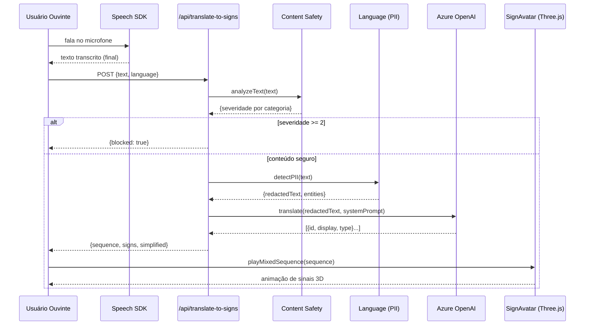
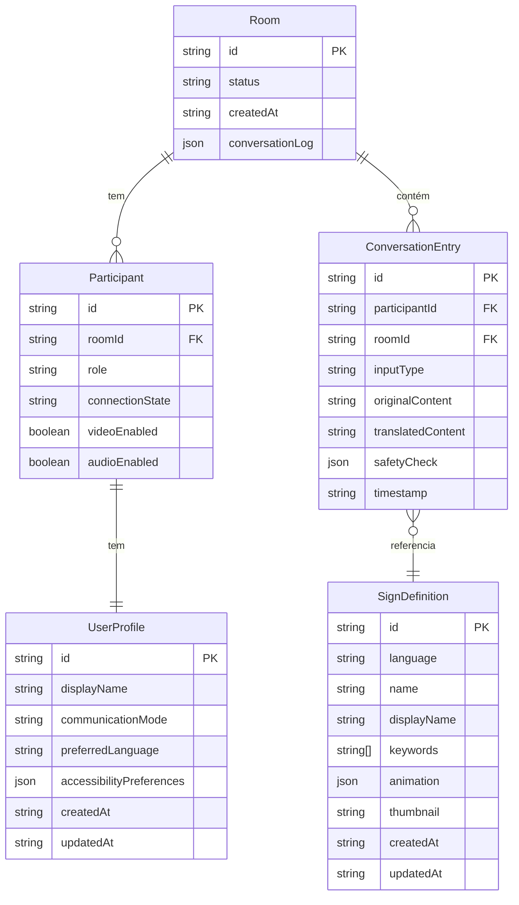

# Azure SignBridge Multimodal — Documentação Completa

> Atualizado em 2026-03-26. Documenta o estado real do código; seções marcadas como **[STUB]** correspondem a módulos com esqueleto definido, mas sem implementação funcional.

---

## Índice

1. [Visão Geral do Projeto](#1-visão-geral-do-projeto)
2. [Arquitetura do Sistema](#2-arquitetura-do-sistema)
3. [Estrutura de Arquivos](#3-estrutura-de-arquivos)
4. [Módulos e Componentes](#4-módulos-e-componentes)
5. [Modelos de Dados](#5-modelos-de-dados)
6. [API / Endpoints](#6-api--endpoints)
7. [Requisitos e Dependências](#7-requisitos-e-dependências)
8. [Instalação e Configuração](#8-instalação-e-configuração)
9. [Comandos Disponíveis](#9-comandos-disponíveis)
10. [Principais Casos de Uso](#10-principais-casos-de-uso)
11. [Testes](#11-testes)
12. [Deploy e CI/CD](#12-deploy-e-cicd)
13. [Convenções e Padrões](#13-convenções-e-padrões)
14. [Problemas Conhecidos e Dívida Técnica](#14-problemas-conhecidos-e-dívida-técnica)

---

## 1. Visão Geral do Projeto

### Nome
**Azure SignBridge Multimodal**

### Propósito
Uma plataforma de comunicação em tempo real que elimina a barreira entre pessoas surdas (usuárias de língua de sinais) e pessoas ouvintes (usuárias de fala), permitindo que ambas se comuniquem em sua modalidade nativa dentro de uma videochamada.

### Problema que resolve
Pessoas surdas ou com deficiência auditiva não conseguem participar de reuniões por vídeo sem um intérprete humano. O SignBridge atua como um intérprete automático bidirecional:

- **Fala → Sinais:** converte o áudio do falante em texto (Azure Speech) e, em seguida, anima um avatar 3D que executa os sinais correspondentes em ASL ou LSC.
- **Sinais → Texto:** usa a câmera do usuário surdo para detectar as mãos com MediaPipe, classifica o sinal e exibe legendas em tempo real.
- **Acessibilidade radical:** todo o pipeline está em conformidade com WCAG 2.1 AA; inclui modo de alto contraste, tamanho de fonte, redução de movimento e configuração de posição de legenda.

### Stack tecnológica completa

| Camada | Tecnologia | Versão |
|---|---|---|
| Framework Web | Next.js | 16.2.1 (App Router) |
| UI | React | 18 |
| Linguagem | TypeScript | 5 |
| Estilos | Tailwind CSS | 3 |
| Animações UI | Framer Motion | — |
| 3D / Avatar | Three.js | — |
| Rastreamento de Mãos | MediaPipe Hands | 0.4 (CDN) |
| Língua de Sinais | Ready Player Me GLB | — |
| IA / LLM | Azure OpenAI (GPT-4o) | API 2024-10-01-preview |
| Voz | Azure Speech SDK | — |
| Tradução | Azure Translator | [STUB] |
| Visão Computacional | Azure Computer Vision | [STUB] |
| Segurança de Conteúdo | Azure AI Content Safety | — |
| Detecção de PII | Azure AI Language | — |
| Videochamadas | Azure Communication Services | — |
| Tempo Real | Azure SignalR Service | [integração STUB] |
| Banco de Dados | Azure Cosmos DB (Core SQL) | — |
| Armazenamento | Azure Blob Storage | — |
| Monitoramento | Azure Application Insights | — |
| Infraestrutura como Código | Azure Bicep | — |
| Conteinerização | Docker (Alpine Linux) | Node 20 Alpine |
| Runtime | Node.js | ≥ 20 |
| Gerenciador de Pacotes | npm | ≥ 10 |

---

## 2. Arquitetura do Sistema

### Padrão arquitetural
**Monólito modular com Next.js App Router.** A aplicação combina:
- **SSR / API Routes** para operações no servidor (autenticação, integração Azure, banco de dados).
- **SPA rich-client** para a sala de reunião (hooks de tempo real, MediaPipe, Three.js).
- **Camada pronta para agentes** — estrutura de agentes de IA orquestrada, pronta para extensão (atualmente um esqueleto).

### Diagrama de arquitetura

```mermaid
graph TB
    subgraph Browser["Navegador do Usuário"]
        direction TB
        RoomPage["Página da Sala\n(app/room/[id])"]
        AvatarComp["SignAvatar\n(Three.js GLB)"]
        MediaPipe["MediaPipe Hands\n(WASM CDN)"]
        SpeechSDK["Azure Speech SDK\n(importação dinâmica)"]
        ACSClient["ACS Calling SDK\n(vídeo/áudio)"]
        SignalRClient["SignalR Client\n[STUB]"]
    end

    subgraph NextAPI["Next.js API Routes (Servidor)"]
        direction TB
        SpeechRoute["/api/speech\n(fornecimento de token)"]
        SignsRoute["/api/signs\n(CRUD)"]
        TranslateRoute["/api/translate-to-signs\n(pipeline GPT-4o)"]
        SummaryRoute["/api/summary\n(GPT-4o)"]
        RoomsRoute["/api/rooms/join\n(token ACS)"]
        SafetyRoute["/api/safety [STUB]"]
        SignRoute["/api/sign [STUB]"]
        TranslatorRoute["/api/translate [STUB]"]
        ProfileRoute["/api/profile [STUB]"]
    end

    subgraph AzureServices["Serviços Azure"]
        direction TB
        OpenAI["Azure OpenAI\n(GPT-4o)"]
        Speech["Azure Speech\n(STT + token)"]
        Cosmos["Azure Cosmos DB\n(container signs)"]
        ACSServer["Azure Communication\nServices"]
        SignalR["Azure SignalR\n[STUB]"]
        ContentSafety["Azure Content Safety"]
        Language["Azure Language\n(Detecção de PII)"]
        Translator["Azure Translator\n[STUB]"]
        Vision["Azure Computer Vision\n[STUB]"]
        Blob["Azure Blob Storage"]
        AppInsights["Application Insights"]
    end

    RoomPage --> SpeechSDK
    RoomPage --> MediaPipe
    RoomPage --> AvatarComp
    RoomPage --> ACSClient
    RoomPage --> SignalRClient

    SpeechSDK -->|"GET /api/speech"| SpeechRoute
    SpeechRoute --> Speech
    RoomPage -->|"POST /api/translate-to-signs"| TranslateRoute
    TranslateRoute --> ContentSafety
    TranslateRoute --> Language
    TranslateRoute --> OpenAI
    RoomPage -->|"POST /api/summary"| SummaryRoute
    SummaryRoute --> OpenAI
    RoomPage -->|"POST /api/rooms/join"| RoomsRoute
    RoomsRoute --> ACSServer
    ACSClient -->|"WebRTC"| ACSServer
    SignalRClient -->|"WebSocket"| SignalR
    SignsRoute --> Cosmos
    AppInsights -.->|"telemetria"| NextAPI
```



### Fluxo de dados — caso de uso Fala → Sinais



### Camadas do sistema

| Camada | Arquivos | Responsabilidade |
|---|---|---|
| **Apresentação** | `app/**`, `components/**` | UI, layout, roteamento Next.js |
| **Hooks** | `hooks/**` | Estado e efeitos do cliente (mídia, chamadas, fala) |
| **API Routes** | `app/api/**` | Endpoints HTTP do lado do servidor, integração Azure |
| **Lib / Azure** | `lib/azure/**` | Clientes e adaptadores para cada serviço Azure |
| **Lib / Avatar** | `lib/avatar/**` | Motor 3D, keyframes ASL/LSC, carregamento de animações |
| **Lib / MediaPipe** | `lib/mediapipe/**` | Rastreamento de mãos e classificação de sinais |
| **Lib / Agents** | `lib/agents/**` | Orquestração de IA (esqueleto, não funcional) |
| **Types** | `types/index.ts` | Contratos TypeScript compartilhados |
| **Scripts** | `scripts/**` | CLI: verificação, seed, download de assets |
| **Infrastructure** | `infrastructure/**` | IaC Bicep para provisionamento Azure |

---

## 3. Estrutura de Arquivos

```
Azure-SignBridge-Multimodal/
│
├── .eslintrc.json               # ESLint: regras Next.js + TypeScript
├── .gitignore                   # Exclusões padrão Next.js
├── Dockerfile                   # Imagem de produção: Node 20 Alpine, usuário não-root
├── next.config.mjs              # Next.js: build standalone, cabeçalhos de segurança
├── package.json                 # Dependências + scripts npm
├── package-lock.json            # Arquivo de lock de dependências
├── postcss.config.mjs           # PostCSS com plugin Tailwind
├── tailwind.config.ts           # Tailwind CSS com cores da marca
├── tsconfig.json                # TypeScript modo strict, alias @/*→src/*
├── README.md                    # Placeholder genérico Next.js
├── DOCUMENTATION.md             # Este documento (inglês)
│
├── public/
│   └── models/avatar/
│       └── avatar.glb           # Modelo 3D Ready Player Me (avatar humanoide)
│
├── src/
│   ├── app/                     # Next.js App Router
│   │   ├── layout.tsx           # Layout raiz: fonte Inter, metadados globais
│   │   ├── page.tsx             # Página de destino: hero, grade de features, CTA
│   │   ├── globals.css          # Variáveis CSS, reset global, base Tailwind
│   │   ├── favicon.ico
│   │   │
│   │   ├── api/                 # API Routes (lado do servidor)
│   │   │   ├── speech/
│   │   │   │   └── route.ts     # GET: gera token Azure Speech (TTL 9 min)
│   │   │   ├── signs/
│   │   │   │   ├── route.ts     # GET lista signs / POST cria sign (Cosmos DB)
│   │   │   │   └── [id]/
│   │   │   │       └── route.ts # GET/PUT/DELETE um sign; POST duplica para outra língua
│   │   │   ├── sign/
│   │   │   │   └── route.ts     # POST: reconhecimento de sinal a partir de landmarks [STUB]
│   │   │   ├── translate/
│   │   │   │   └── route.ts     # POST: tradução Azure Translator [STUB]
│   │   │   ├── translate-to-signs/
│   │   │   │   └── route.ts     # POST: texto → sequência de sinais via GPT-4o + segurança
│   │   │   ├── safety/
│   │   │   │   └── route.ts     # POST: análise de segurança de conteúdo [STUB]
│   │   │   ├── summary/
│   │   │   │   └── route.ts     # POST: resumo de reunião via GPT-4o
│   │   │   ├── profile/
│   │   │   │   └── route.ts     # GET/PUT: perfil de acessibilidade do usuário [STUB]
│   │   │   └── rooms/
│   │   │       └── join/
│   │   │           └── route.ts # POST: cria usuário ACS e retorna token VoIP
│   │   │
│   │   ├── room/
│   │   │   ├── new/
│   │   │   │   └── page.tsx     # Redirect: gera UUID e redireciona para /room/<uuid>
│   │   │   └── [id]/
│   │   │       └── page.tsx     # Sala de reunião principal (componente primário)
│   │   │
│   │   ├── admin/
│   │   │   └── signs/
│   │   │       └── page.tsx     # CRUD de sinais para admin (gestão do banco de dados)
│   │   │
│   │   └── test/                # Páginas de teste manual (não são testes automatizados)
│   │       ├── avatar/page.tsx           # Teste de renderização do avatar
│   │       ├── avatar-debug/page.tsx     # Debug de ossos e animações
│   │       ├── avatar-calibrate/page.tsx # Calibração de poses
│   │       ├── sign/page.tsx             # Teste de reconhecimento de sinais
│   │       └── speech/page.tsx           # Teste de reconhecimento de fala
│   │
│   ├── components/              # Componentes React (Client Components)
│   │   ├── SignAvatar.tsx        # Wrapper do avatar 3D: carregamento, erro, rótulo animado
│   │   ├── VideoStream.tsx       # Renderização do stream de vídeo ACS
│   │   ├── TranscriptionOverlay.tsx  # Overlay de legendas em tempo real
│   │   ├── ChatPanel.tsx         # Painel de histórico de mensagens
│   │   ├── OnboardingModal.tsx   # Modal de seleção de modo de comunicação
│   │   ├── SessionSummary.tsx    # Resumo ao fim da sessão
│   │   ├── MeetingSummary.tsx    # Visualização do resumo GPT-4o
│   │   ├── ResponsibleAIPanel.tsx # Painel de transparência de IA (métricas)
│   │   ├── AccessibilityPanel.tsx # Painel de configurações de acessibilidade
│   │   ├── SignRecognizer.tsx    # Overlay de visualização de detecção de mãos
│   │   └── admin/
│   │       └── PhotoCalibrator.tsx  # Ferramenta de calibração de poses do avatar
│   │
│   ├── hooks/                   # Custom React Hooks (cliente)
│   │   ├── useSpeechRecognition.ts  # Azure Speech: reconhecimento contínuo
│   │   ├── useSignRecognition.ts    # MediaPipe + classificação de sinais
│   │   ├── useAcsCalling.ts         # Azure ACS: videochamada em grupo
│   │   ├── useAccessibility.ts      # Perfil de acessibilidade do usuário [STUB]
│   │   └── useSignalR.ts            # Conexão com SignalR Hub [STUB]
│   │
│   ├── lib/                     # Lógica de negócio sem React
│   │   ├── azure/               # Clientes de serviços Azure
│   │   │   ├── openai.ts        # Factory do cliente AzureOpenAI
│   │   │   ├── speech.ts        # Builder do Recognizer + tipos de token
│   │   │   ├── translator.ts    # Cliente Azure Translator [STUB]
│   │   │   ├── vision.ts        # Cliente Computer Vision [STUB]
│   │   │   ├── content-safety.ts # Análise de texto (4 categorias, limiar de severidade ≥ 2)
│   │   │   ├── pii-detection.ts # Detecção e redação de PII (API v3.1)
│   │   │   ├── cosmos.ts        # Cliente singleton Cosmos DB
│   │   │   ├── signs-db.ts      # CRUD de sinais: getAllSigns, getSign, createSign, etc.
│   │   │   ├── communication.ts # Inicialização ACS [STUB]
│   │   │   └── signalr.ts       # Negociação SignalR [STUB]
│   │   │
│   │   ├── mediapipe/           # Rastreamento e reconhecimento de mãos
│   │   │   ├── hand-tracker.ts  # Carrega MediaPipe do CDN, desenha esqueleto de 21 landmarks no canvas
│   │   │   └── sign-classifier.ts # Classificação baseada em regras (13 formas estáticas de mão)
│   │   │
│   │   ├── avatar/              # Motor de avatar 3D e base de animações
│   │   │   ├── avatar-engine.ts      # Three.js: carrega GLB, interpola keyframes, idle, piscar
│   │   │   ├── sign-core.ts          # Tipos: FingerRotation, HandPose, ArmPose, AvatarKeyframe
│   │   │   ├── sign-animations.ts    # Barrel: exporta todas as animações + helpers
│   │   │   ├── sign-animations-asl.ts # 38+ sinais ASL com keyframes completos (~38KB)
│   │   │   ├── sign-animations-lsc.ts # LSC (Língua de Sinais Colombiana): vocabulário estendido + alfabeto completo
│   │   │   ├── sign-animations-lsb.ts # LSB (Língua Brasileira de Sinais): 73 sinais + 26 letras + 98 mapeamentos
│   │   │   ├── sign-loader.ts        # Seleciona ASL / LSC / LSB com base na língua da UI
│   │   │   ├── sign-languages.ts     # Mapeamento: código de língua da UI → língua de sinais (3 línguas)
│   │   │   └── sign-db-loader.ts     # Converte SignDefinition do Cosmos DB → SignAnimation
│   │   │
│   │   └── agents/              # Orquestração de IA (esqueleto, não funcional)
│   │       ├── orchestrator.ts  # Pipeline orientado a eventos [STUB]
│   │       ├── sign-agent.ts    # Landmarks → tradução [STUB]
│   │       ├── speech-agent.ts  # Áudio → transcrição [STUB]
│   │       ├── safety-agent.ts  # Filtragem de conteúdo [STUB]
│   │       └── summary-agent.ts # Resumo de reunião [STUB]
│   │
│   └── types/
│       └── index.ts             # Registro central de tipos TypeScript (200+ linhas)
│
├── scripts/
│   ├── tsconfig.json            # Config TypeScript para scripts (CommonJS)
│   ├── verify-azure.ts          # Health check para 11 serviços Azure (500+ linhas)
│   ├── download-avatar.ts       # Baixa modelo GLB do CDN/API
│   ├── seed-signs.ts            # Popula Cosmos DB com dados iniciais de sinais
│   └── inspect-avatar.ts        # Inspeciona esqueleto GLB (nomes dos ossos)
│
└── infrastructure/
    ├── main.bicep               # IaC: todas as definições de recursos Azure (~1000 linhas)
    ├── parameters.dev.json      # Parâmetros para ambiente de desenvolvimento
    ├── parameters.prod.json     # Parâmetros para produção (maior capacidade)
    ├── deploy.sh                # Script Bash: executa az deployment group create
    └── deploy-app.sh            # Script Bash: faz deploy da aplicação no recurso
```

**Convenções de nomenclatura:**
- Arquivos de componentes React: `PascalCase.tsx`
- Hooks: `useCamelCase.ts`
- Módulos de biblioteca: `kebab-case.ts`
- API routes: pastas kebab-case com `route.ts` dentro
- Scripts: `kebab-case.ts`

---

## 4. Módulos e Componentes

### 4.1 App Router (`src/app/`)

| Componente | Responsabilidade |
|---|---|
| `layout.tsx` | Fornece fonte Inter, metadados `<head>`, wrapper global |
| `page.tsx` | Página de marketing com hero, cards de features e botão CTA |
| `room/new/page.tsx` | Gera UUID com `crypto.randomUUID()` e redireciona para `/room/<uuid>` |
| `room/[id]/page.tsx` | Orquestra toda a sala: hooks, estado, layout de duas colunas, modais |
| `admin/signs/page.tsx` | CRUD de sinais para administradores; usa `/api/signs` |
| `test/*/page.tsx` | Páginas de teste manual isoladas para cada subsistema |

### 4.2 Componentes React (`src/components/`)

| Componente | Props Principais | Responsabilidade |
|---|---|---|
| `SignAvatar` | `skinTone, speed, onSignStart, onSignEnd` | Wrapper de `AvatarEngine`; expõe ref com métodos `playSign`, `playSequence`, `fingerspell`, `playMixedSequence`, `setSkinTone`, `setSpeed`, `setStaticPose` |
| `TranscriptionOverlay` | — | Exibe legendas ao vivo (texto final + interino) sobre o vídeo |
| `ChatPanel` | — | Histórico de `ConversationEntry[]` com ícones de tipo e status de segurança |
| `OnboardingModal` | — | Seleção de modo (`speak` / `sign` / `text`) ao entrar em uma sala |
| `SessionSummary` | — | Modal final com resumo GPT-4o, tópicos e itens de ação |
| `MeetingSummary` | — | Card com summary, topics[] e actionItems[] |
| `ResponsibleAIPanel` | — | Exibe `ResponsibleAIMetrics`: verificações, filtrados, PII redatados, pontuação |
| `AccessibilityPanel` | — | Controles para alto contraste, tamanho de fonte, posição de legenda, tom de pele do avatar |
| `VideoStream` | — | Renderiza `RemoteVideoStream` ACS em um elemento `<video>` |
| `SignRecognizer` | — | Sobrepõe canvas do esqueleto da mão sobre o feed da câmera |
| `admin/PhotoCalibrator` | — | Permite definir poses estáticas do avatar para capturar keyframes |

**Dependências entre componentes:**
- `room/[id]/page.tsx` importa e orquestra todos os outros componentes
- `SignAvatar` depende de `AvatarEngine` (importação dinâmica)
- `SignRecognizer` depende de `hand-tracker.ts`

### 4.3 Custom Hooks (`src/hooks/`)

#### `useSpeechRecognition(language: string)`
- **Estado:** `isListening`, `isLoading`, `transcript`, `interimText`, `error`
- **Métodos:** `startListening()`, `stopListening()`, `clearTranscript()`
- **Fluxo:** Busca token em `/api/speech` → importa dinamicamente o Speech SDK → constrói `SpeechRecognizer` → acumula texto final; exibe texto interino enquanto o usuário fala → renova o token antes do vencimento (a cada 9 min)
- **Depende de:** `lib/azure/speech.ts`, `/api/speech`

#### `useSignRecognition()`
- **Estado:** `isDetecting`, `isLoading`, `currentSign`, `currentEmoji`, `confidence`, `handsDetected`, `fps`, `fingerState`, `error`
- **Métodos:** `start(videoEl, canvasEl)`, `stop()`
- **Fluxo:** Carrega MediaPipe do CDN → processa frames a 30 FPS → classifica forma da mão → debounce de 500ms (sinal deve ser mantido) → emite `currentSign`
- **Depende de:** `lib/mediapipe/hand-tracker.ts`, `lib/mediapipe/sign-classifier.ts`

#### `useAcsCalling(roomId, startCall, onMessageReceived)`
- **Estado:** `call`, `remoteStreams[]`, `localVideoStream`, `error`
- **Métodos:** `toggleMic(mute)`, `toggleCam(turnOff)`, `sendData(payload)`
- **Fluxo:** Chama `/api/rooms/join` → inicializa `CallClient` + `DeviceManager` → entra no grupo com `groupId=roomId` → assina streams remotos → DataChannel (channelId: 100) para mensagens de dados
- **Depende de:** `@azure/communication-calling`, `/api/rooms/join`

#### `useAccessibility()` [STUB]
- **Estado:** `profile` (valores padrão fixos)
- **TODO:** Persistir em `/api/profile` (Cosmos DB)

#### `useSignalR(roomId)` [STUB]
- **Propósito:** Conexão SignalR para broadcast em tempo real
- **TODO:** Implementar `HubConnectionBuilder`, assinar eventos

### 4.4 Biblioteca Azure (`src/lib/azure/`)

| Módulo | Status | Responsabilidade |
|---|---|---|
| `openai.ts` | ✅ | Factory `createOpenAIClient()` → `AzureOpenAI` com variáveis de ambiente |
| `speech.ts` | ✅ | `buildSpeechRecognizer(token, region, lang)` + tipos de token |
| `content-safety.ts` | ✅ | `analyzeTextSafety(text)` → categorias + severidade |
| `pii-detection.ts` | ✅ | `detectAndRedactPII(text, lang)` → texto redatado + entidades |
| `cosmos.ts` | ✅ | Singleton `CosmosClient` + referências de DB/container |
| `signs-db.ts` | ✅ | CRUD completo sobre o container `signs` |
| `communication.ts` | [STUB] | Inicialização ACS |
| `signalr.ts` | [STUB] | Negociação SignalR |
| `translator.ts` | [STUB] | Azure Translator |
| `vision.ts` | [STUB] | Azure Computer Vision |

### 4.5 Motor de Avatar (`src/lib/avatar/`)

| Módulo | Responsabilidade |
|---|---|
| `avatar-engine.ts` | Motor Three.js: carrega GLB, sistema de keyframes, respiração idle, piscar, fila de reprodução |
| `sign-core.ts` | Tipos: `FingerRotation`, `HandPose`, `ArmPose`, `AvatarKeyframe`, `SignAnimation` |
| `sign-animations-asl.ts` | 38+ sinais ASL com keyframes completos + mapa `WORD_TO_SIGN_ASL` |
| `sign-animations-lsc.ts` | LSC (Língua de Sinais Colombiana): vocabulário estendido + alfabeto completo (1736 linhas) |
| `sign-animations-lsb.ts` | LSB (Língua Brasileira de Sinais): 73 sinais lexicais + 26 letras (letra_a…letra_z) + 98 mapeamentos `WORD_TO_SIGN_LSB` (1299 linhas) |
| `sign-animations.ts` | Barrel de exportações + helpers de interpolação |
| `sign-loader.ts` | Seleciona ASL / LSC / LSB com base na língua da UI |
| `sign-languages.ts` | Mapeamento: código de língua da UI → `SignLanguageCode` ("ASL" \| "LSC" \| "LSB") — en-US→ASL, es-CO→LSC, pt-BR→LSB, es-ES→ASL |
| `sign-db-loader.ts` | Converte `SignDefinition` do Cosmos DB para `SignAnimation` |

**Capacidades do AvatarEngine:**
- Esqueleto: 4 ossos por braço × 2 + 3 articulações × 5 dedos × 2 + coluna + cabeça
- Interpolação suave entre keyframes com easing
- Retorno natural ao descanso 500ms após o último sinal
- Micro-oscilação dos dedos em repouso (efeito natural)
- Respiração idle (leve oscilação da coluna)
- Piscar via morph targets (`eyeBlinkLeft`, `eyeBlinkRight`)
- Fila de animações para encadeamento suave
- Multiplicador de velocidade (0.3×–3×)
- Tonalidade de cor de pele (claro/médio/escuro)

### 4.6 MediaPipe (`src/lib/mediapipe/`)

| Módulo | Responsabilidade |
|---|---|
| `hand-tracker.ts` | Carrega MediaPipe Hands 0.4 do CDN (WASM 8MB), desenha esqueleto de 21 landmarks no canvas |
| `sign-classifier.ts` | Classificação baseada em regras: detecta extensão de dedos → 13 formas estáticas de mão |

**Sinais reconhecidos:** Punho, Polegar para cima, Paz/Vitória, Mão Aberta (5), ILY, Apontar para cima, e outras formas estáticas. Confiança: similaridade Hamming ≥ 80%.

---

## 5. Modelos de Dados

### 5.1 Cosmos DB — Container `signs`

```
Database: signbridge (configurável via AZURE_COSMOS_DATABASE)
Container: signs
Partition key: /language
```

**Documento `SignDefinition`:**
```typescript
{
  id: string,              // UUID gerado automaticamente
  language: string,        // "ASL" | "LSC" — partition key
  name: string,            // Nome do sinal (ex.: "hello")
  displayName: string,     // Nome de exibição (ex.: "Hello / Hola")
  keywords: string[],      // Para busca (ex.: ["hi", "greeting"])
  animation: {             // Keyframes completos de animação
    keyframes: AvatarKeyframe[],
    duration: number
  },
  thumbnail?: string,      // URL no Azure Blob Storage
  createdAt: string,       // Timestamp ISO
  updatedAt: string        // Timestamp ISO
}
```

**Operações disponíveis em `signs-db.ts`:**
- `getAllSigns(language?)` — SQL: `SELECT * FROM c WHERE c.language = @lang ORDER BY c.name`
- `getSign(id)` — Fetch por ponto (id + partition key)
- `createSign(sign)` — Inserção com timestamps automáticos
- `updateSign(id, updates)` — Merge + atualiza `updatedAt`
- `deleteSign(id)` — Exclusão por ponto
- `searchByKeyword(keyword, language?)` — `ARRAY_CONTAINS(c.keywords, @kw)`
- `duplicateSign(id, targetLanguage)` — Copia com novo id e partition key

### 5.2 Tipos TypeScript principais (`src/types/index.ts`)

```typescript
// Preferências de acessibilidade
interface AccessibilityPreferences {
  highContrast: boolean;
  fontSize: "small" | "medium" | "large" | "x-large";
  reduceMotion: boolean;
  captionsEnabled: boolean;
  signAvatarEnabled: boolean;
  speechRate: number;           // 0.5 - 2.0
  voicePreference: string;
}

// Perfil do usuário
interface UserProfile {
  id: string;
  displayName: string;
  communicationMode: "speech" | "sign" | "text";
  preferredLanguage: string;   // BCP-47 (ex.: "pt-BR")
  accessibilityPreferences: AccessibilityPreferences;
  createdAt: string;
  updatedAt: string;
}

// Entrada de conversa
interface ConversationEntry {
  id: string;
  participantId: string;
  timestamp: string;
  inputType: "speech" | "sign" | "text";
  originalContent: string;
  translatedContent: string;
  simplifiedContent?: string;
  sentiment?: SentimentResult;
  safetyCheck: SafetyCheckResult;
}

// Resultado de segurança
interface SafetyCheckResult {
  isAllowed: boolean;
  categories: { hate: number; sexual: number; violence: number; selfHarm: number };
  piiDetected: string[];
  explanation: string;
}

// Resumo de reunião
interface MeetingSummary {
  roomId: string;
  duration: number;            // milissegundos
  participantCount: number;
  keyTopics: string[];
  actionItems: string[];
  fullTranscript: ConversationEntry[];
  accessibleSummary: string;
  generatedAt: string;
  responsibleAIMetrics: ResponsibleAIMetrics;
}

// Métricas de IA Responsável
interface ResponsibleAIMetrics {
  contentSafetyChecks: number;
  contentFiltered: number;
  piiRedacted: number;
  averageConfidence: number;
  transparencyScore: number;   // 0-1
}

// Tipos de mensagem SignalR (union discriminada)
type SignalRMessageType =
  | "transcription"
  | "sign_detected"
  | "translation"
  | "avatar_command"
  | "safety_alert"
  | "participant_update";
```

### 5.3 Diagrama ER simplificado



> Nota: Apenas `SignDefinition` é atualmente persistido no Cosmos DB. `Room`, `Participant` e `ConversationEntry` existem como tipos TypeScript, mas sem persistência implementada.

---

## 6. API / Endpoints

### Autenticação
Nenhuma autenticação de usuário está implementada atualmente. As rotas da API são públicas (qualquer cliente pode chamá-las). As credenciais Azure são acessadas apenas do servidor via variáveis de ambiente.

### Resumo dos endpoints

| Método | Caminho | Status | Descrição |
|---|---|---|---|
| GET | `/api/speech` | ✅ | Token Azure Speech para o cliente |
| GET | `/api/signs` | ✅ | Lista de sinais (com filtro opcional) |
| POST | `/api/signs` | ✅ | Criar novo sinal |
| GET | `/api/signs/[id]` | ✅ | Obter sinal por ID |
| PUT | `/api/signs/[id]` | ✅ | Atualizar sinal |
| DELETE | `/api/signs/[id]` | ✅ | Excluir sinal |
| POST | `/api/signs/[id]?action=duplicate` | ✅ | Duplicar sinal para outra língua |
| POST | `/api/translate-to-signs` | ✅ | Texto → sequência de sinais (GPT-4o) |
| POST | `/api/summary` | ✅ | Resumo de reunião (GPT-4o) |
| POST | `/api/rooms/join` | ✅ | Token ACS para videochamada |
| POST | `/api/safety` | [STUB] | Análise de conteúdo |
| POST | `/api/translate` | [STUB] | Tradução de texto |
| POST | `/api/sign` | [STUB] | Reconhecimento de sinal |
| GET | `/api/profile` | [STUB] | Perfil de acessibilidade |
| PUT | `/api/profile` | [STUB] | Atualizar perfil |

---

### Detalhes dos endpoints funcionais

#### `GET /api/speech`
Fornece um token Azure Speech ao cliente. O token tem TTL de 9 minutos.

**Resposta 200:**
```json
{
  "token": "eyJ...",
  "region": "eastus2",
  "expiresAt": 1711234567000
}
```
**Erros:** 500 se `AZURE_SPEECH_KEY` ou `AZURE_SPEECH_REGION` não estiverem configurados.

---

#### `GET /api/signs`
Lista sinais do container Cosmos DB.

**Parâmetros de query:**
| Parâmetro | Tipo | Descrição |
|---|---|---|
| `language` | string | Filtrar por língua de sinais (ex.: `ASL`, `LSC`) |
| `q` | string | Busca por palavra-chave |

**Resposta 200:** `SignDefinition[]`

---

#### `POST /api/signs`
Cria um novo sinal.

**Body:** `SignDefinition` (sem `id`, `createdAt`, `updatedAt`)

**Resposta 201:** `SignDefinition` criado

---

#### `GET /api/signs/[id]`
Obtém um sinal por ID.

**Parâmetro de rota:** `id` (UUID)

**Resposta 200:** `SignDefinition`

**Erros:** 404 se não encontrado.

---

#### `PUT /api/signs/[id]`
Atualiza campos do sinal (merge parcial).

**Body:** `SignDefinition` parcial

**Resposta 200:** `SignDefinition` atualizado

---

#### `DELETE /api/signs/[id]`
Exclui um sinal.

**Resposta 204:** Sem body

---

#### `POST /api/signs/[id]?action=duplicate&language=LSC`
Duplica um sinal para outra língua de sinais.

**Parâmetros de query:**
| Parâmetro | Tipo | Descrição |
|---|---|---|
| `action` | `"duplicate"` | Ação obrigatória |
| `language` | string | Língua de destino (ex.: `LSC`) |

**Resposta 201:** Novo `SignDefinition` com a língua de destino

---

#### `POST /api/translate-to-signs` ⭐
Pipeline completo de tradução com segurança.

**Body:**
```json
{
  "text": "Olá, como vai você?",
  "language": "pt-BR"
}
```

**Pipeline interno:**
1. `analyzeTextSafety(text)` → bloqueia se qualquer categoria ≥ severidade 2
2. `detectAndRedactPII(text)` → substitui dados pessoais por `[REDACTED]`
3. GPT-4o com um system prompt especializado em gramática de língua de sinais
4. Validação do output JSON e fallback para mapeamento local se o GPT falhar

**Resposta 200:**
```json
{
  "sequence": [
    { "type": "sign", "id": "hello", "display": "Olá" },
    { "type": "spell", "word": "como", "display": "C-O-M-O" }
  ],
  "signs": ["hello", "you"],
  "simplified": "Olá você",
  "original": "Olá, como vai você?",
  "safetyCheck": {
    "hate": 0, "sexual": 0, "violence": 0, "selfHarm": 0,
    "piiRedacted": 0
  }
}
```

**Resposta 200 (bloqueado):**
```json
{
  "blocked": true,
  "reason": "Limite de segurança de conteúdo excedido",
  "categories": { "hate": 4, "sexual": 0, "violence": 0, "selfHarm": 0 }
}
```

---

#### `POST /api/summary` ⭐
Gera um resumo de reunião acessível usando GPT-4o.

**Body:**
```json
{
  "conversationLog": [ConversationEntry],
  "sessionDuration": 3600000,
  "signsCount": 45,
  "wordsCount": 320,
  "safetyCount": 5,
  "piiCount": 2
}
```

**Resposta 200:**
```json
{
  "summary": "Nesta reunião, discutimos...",
  "topics": ["Orçamento 2026", "Equipe de design"],
  "actionItems": ["Enviar proposta para João", "Revisar mockups"],
  "tone": "professional"
}
```

**Fallback:** Se o GPT-4o estiver indisponível, retorna estatísticas básicas da sessão.

---

#### `POST /api/rooms/join` ⭐
Cria uma identidade ACS e retorna credenciais de videochamada.

**Body:** `{}` (vazio; roomId vem do contexto da sala)

**Resposta 200:**
```json
{
  "communicationUserId": "8:acs:abc123...",
  "token": "eyJhbGciOi...",
  "expiresOn": "2026-03-26T15:00:00.000Z"
}
```

**Erros:** 500 se `ACS_CONNECTION_STRING` não estiver configurado.

---

## 7. Requisitos e Dependências

### Requisitos do sistema
- **Node.js:** ≥ 20
- **npm:** ≥ 10
- **Sistema Operacional:** Linux, macOS ou Windows (WSL2)
- **GPU:** Não necessário (Three.js usa WebGL do navegador)
- **Navegador:** Chrome/Edge 90+ (MediaPipe WASM + WebGL + WebRTC)

### Serviços Azure necessários
| Serviço | Propósito |
|---|---|
| Azure OpenAI (deployment GPT-4o) | Tradução texto → sinais, resumo de reunião |
| Azure Speech Services | STT contínuo, fornecimento de token |
| Azure Cosmos DB | Banco de dados de sinais |
| Azure Communication Services | Videochamada em grupo + token de identidade |

### Serviços Azure opcionais (atualmente stubs)
| Serviço | Propósito |
|---|---|
| Azure AI Content Safety | Verificação de segurança de mensagens |
| Azure AI Language | Detecção e redação de PII |
| Azure SignalR | Broadcast em tempo real entre participantes |
| Azure Translator | Tradução multilíngue |
| Azure Computer Vision | Análise de imagens |
| Azure Blob Storage | Assets do avatar e miniaturas |
| Azure Application Insights | Telemetria e monitoramento |

### Dependências de produção (package.json)

| Pacote | Propósito |
|---|---|
| `next` | Framework web SSR + App Router |
| `react`, `react-dom` | Biblioteca de UI |
| `typescript` | Linguagem tipada |
| `tailwindcss` | Estilos utilitários |
| `framer-motion` | Animações de UI |
| `three` | Renderização de avatar 3D |
| `@azure/openai` | Cliente Azure OpenAI (GPT-4o) |
| `microsoft-cognitiveservices-speech-sdk` | Azure Speech SDK |
| `@azure/cosmos` | Cliente Cosmos DB |
| `@azure/communication-calling` | SDK de videochamada ACS |
| `@azure/communication-common` | Tipos comuns ACS |
| `@azure/communication-identity` | Criação de usuário ACS |
| `@azure/ai-text-analytics` | Serviço de Linguagem (detecção de PII) |
| `@azure/storage-blob` | SDK Azure Blob Storage |
| `@microsoft/signalr` | Cliente SignalR (v10) |
| `@gltf-transform/core` | Processamento/transformação do modelo GLB |
| `@gltf-transform/extensions` | Extensões do processador GLTF |

### Dependências de desenvolvimento

| Pacote | Propósito |
|---|---|
| `@types/node`, `@types/react` | Tipos TypeScript |
| `@types/three` | Tipos Three.js |
| `eslint`, `eslint-config-next` | Linting |
| `tsx` | Executa scripts TypeScript diretamente |
| `postcss` | Processamento CSS (necessário para Tailwind) |
| `dotenv` | Carrega `.env` em scripts Node (verify-azure, seed-signs) |

### Variáveis de ambiente

Todas as variáveis devem estar em `.env.local`. Copie `.env.local.example` como base.

| Variável | Obrigatória | Descrição |
|---|---|---|
| `AZURE_OPENAI_ENDPOINT` | ✅ | URL do recurso Azure OpenAI |
| `AZURE_OPENAI_KEY` | ✅ | Chave de API do Azure OpenAI |
| `AZURE_OPENAI_DEPLOYMENT` | ✅ | Nome do deployment GPT-4o |
| `AZURE_SPEECH_KEY` | ✅ | Chave de assinatura do Speech Services |
| `AZURE_SPEECH_REGION` | ✅ | Região (ex.: `eastus2`) |
| `AZURE_COSMOS_ENDPOINT` | ✅ | URL da conta Cosmos DB |
| `AZURE_COSMOS_KEY` | ✅ | Chave primária do Cosmos DB |
| `AZURE_COSMOS_DATABASE` | ✅ | Nome do banco de dados (padrão: `signbridge`) |
| `ACS_CONNECTION_STRING` | ✅ | String de conexão do Azure Communication Services |
| `AZURE_CONTENT_SAFETY_ENDPOINT` | ⚠️ | URL do recurso Content Safety |
| `AZURE_CONTENT_SAFETY_KEY` | ⚠️ | Chave de API do Content Safety |
| `AZURE_LANGUAGE_ENDPOINT` | ⚠️ | URL do recurso Azure Language (PII) |
| `AZURE_LANGUAGE_KEY` | ⚠️ | Chave de API do Azure Language |
| `AZURE_SIGNALR_CONNECTION_STRING` | ⚠️ | String de conexão SignalR [STUB] |
| `AZURE_COMMUNICATION_CONNECTION_STRING` | ⚠️ | Alternativa a `ACS_CONNECTION_STRING` |
| `AZURE_TRANSLATOR_KEY` | ⚠️ | Chave de API do Azure Translator [STUB] |
| `AZURE_TRANSLATOR_REGION` | ⚠️ | Região do Translator [STUB] |
| `AZURE_VISION_ENDPOINT` | ⚠️ | URL do Computer Vision [STUB] |
| `AZURE_VISION_KEY` | ⚠️ | Chave de API do Computer Vision [STUB] |
| `AZURE_STORAGE_CONNECTION_STRING` | ⚠️ | String de conexão do Blob Storage [STUB] |
| `AZURE_STORAGE_CONTAINER` | ⚠️ | Nome do container (padrão: `signbridge-assets`) |
| `APPLICATIONINSIGHTS_CONNECTION_STRING` | ⚠️ | String de conexão do App Insights |
| `NEXT_PUBLIC_SIGNALR_URL` | ⚠️ | URL do hub SignalR (exposto ao cliente) |

✅ = necessário para funcionalidade central · ⚠️ = necessário para features específicas

---

## 8. Instalação e Configuração

### Passo 1: Clonar o repositório
```bash
git clone <url-do-repo>
cd Azure-SignBridge-Multimodal
```

### Passo 2: Instalar dependências
```bash
npm install
```

### Passo 3: Configurar variáveis de ambiente
```bash
cp .env.local.example .env.local
# Edite .env.local com as credenciais reais do Azure
```

### Passo 4: Provisionar recursos Azure (opcional — se não existirem)
```bash
cd infrastructure

# Instalar Azure CLI se não estiver instalado
# https://docs.microsoft.com/pt-br/cli/azure/install-azure-cli

az login

# Criar grupo de recursos
az group create --name signbridge-rg --location eastus2

# Deploy da infraestrutura (ambiente dev)
./deploy.sh dev
```

### Passo 5: Baixar modelo do avatar
```bash
npm run download-avatar
# Baixa avatar.glb para public/models/avatar/
```

### Passo 6: Criar banco de dados e container no Cosmos DB
O container `signs` com partition key `/language` deve ser criado manualmente ou via portal Azure, ou é criado automaticamente pelo Bicep.

### Passo 7: Popular sinais iniciais
```bash
npm run seed-signs
# Carrega animações iniciais de ASL/LSC no Cosmos DB
```

### Passo 8: Verificar conectividade Azure
```bash
npm run verify:azure
# Verifica todos os 11 serviços e mostra status OK/FAIL/SKIP
```

### Passo 9: Iniciar em desenvolvimento
```bash
npm run dev
# Disponível em http://localhost:3000
```

### Notas de configuração
- O modelo `avatar.glb` (Ready Player Me) **deve existir** em `public/models/avatar/avatar.glb` antes de iniciar
- O MediaPipe Hands carrega do CDN no primeiro uso (requer conexão à internet)
- O Azure Speech SDK (~2MB) carrega dinamicamente no primeiro uso

---

## 9. Comandos Disponíveis

| Comando | Script | Quando usar |
|---|---|---|
| `npm run dev` | `next dev` | Desenvolvimento local com hot reload |
| `npm run build` | `next build` | Build de produção (gera `.next/standalone`) |
| `npm run start` | `next start` | Executar build de produção localmente |
| `npm run lint` | `next lint` | Verificar regras ESLint |
| `npm run verify:azure` | `tsx scripts/verify-azure.ts` | Verificar conectividade com todos os serviços Azure |
| `npm run download-avatar` | `tsx scripts/download-avatar.ts` | Baixar modelo GLB do avatar |
| `npm run seed-signs` | `tsx scripts/seed-signs.ts` | Popular Cosmos DB com sinais iniciais |

### Comandos de infraestrutura (`infrastructure/`)

```bash
# Deploy completo da infraestrutura
./deploy.sh [dev|prod]

# Deploy apenas da aplicação (sem recriar infraestrutura)
./deploy-app.sh [dev|prod]
```

### Comandos Docker

```bash
# Build da imagem
docker build -t signbridge .

# Executar (requer .env com variáveis Azure)
docker run -p 3000:3000 --env-file .env.local signbridge
```

---

## 10. Principais Casos de Uso

### UC-01: Usuário ouvinte fala → Usuário surdo vê sinais

**Ator:** Usuário ouvinte (sem deficiência auditiva)
**Pré-condição:** Sala criada, usuário em modo `speech`, microfone disponível
**Fluxo:**
1. Usuário navega para `/room/<uuid>` e seleciona o modo `speak` no modal de onboarding
2. O hook `useSpeechRecognition` busca token em `/api/speech` e inicia o reconhecimento contínuo
3. O Azure Speech SDK transcreve o áudio em tempo real; o texto interino aparece no `TranscriptionOverlay`
4. Quando uma frase termina, o texto final é enviado para `POST /api/translate-to-signs`
5. O pipeline verifica segurança → redige PII → GPT-4o gera sequência de sinais
6. A resposta `sequence[]` é passada para `SignAvatar`, que executa `playMixedSequence()`
7. O avatar 3D realiza os sinais; cada sinal exibe sua etiqueta por 1s

**Resultado esperado:** O participante surdo vê o avatar realizando os sinais do usuário ouvinte em tempo real.

**Fluxo alternativo — conteúdo bloqueado:** Se a verificação de segurança retornar `blocked: true`, o avatar não anima e um indicador de conteúdo filtrado aparece no `ResponsibleAIPanel`.

---

### UC-02: Usuário surdo sinaliza → Usuário ouvinte lê legendas

**Ator:** Usuário surdo (usa língua de sinais)
**Pré-condição:** Sala criada, câmera disponível, usuário em modo `sign`
**Fluxo:**
1. Usuário seleciona modo `sign` no onboarding
2. O hook `useSignRecognition` carrega o MediaPipe e começa a processar frames da câmera
3. O `SignRecognizer` exibe o overlay do esqueleto das mãos em tempo real
4. Quando um sinal é detectado com confiança ≥ 80% por 500ms: `currentSign` é atualizado
5. O texto do sinal aparece no `TranscriptionOverlay` para os outros participantes
6. [FUTURO] O texto seria enviado via SignalR para os outros participantes

**Resultado esperado:** Outros participantes leem os sinais do usuário surdo como legendas.

---

### UC-03: Criar sala e entrar na videochamada

**Ator:** Qualquer usuário
**Pré-condição:** Servidor rodando, ACS configurado
**Fluxo:**
1. Usuário navega para a landing page e clica em "Iniciar Reunião"
2. `room/new/page.tsx` gera um UUID e redireciona para `/room/<uuid>`
3. O componente da sala chama `POST /api/rooms/join` para obter o token ACS
4. O hook `useAcsCalling` inicializa o `CallClient` e entra no grupo com `groupId=roomId`
5. A câmera local ativa; participantes remotos aparecem em componentes `VideoStream`
6. O DataChannel (channelId: 100) fica disponível para mensagens de dados entre participantes

**Resultado esperado:** Videochamada ativa com múltiplos participantes, áudio e vídeo bidirecionais.

---

### UC-04: Encerrar sessão e ver resumo

**Ator:** Qualquer participante
**Pré-condição:** Sessão ativa com pelo menos uma `ConversationEntry` no log
**Fluxo:**
1. Usuário clica em "Encerrar Sessão"
2. A sala envia `POST /api/summary` com o `conversationLog[]` completo e as métricas
3. GPT-4o gera um resumo acessível em linguagem simples + tópicos + itens de ação
4. O componente `SessionSummary` exibe o resumo, métricas de IA responsável e estatísticas
5. O `ResponsibleAIPanel` mostra quantas verificações de segurança foram feitas, quanto foi filtrado, PII redatado

**Resultado esperado:** Resumo legível da reunião com métricas de transparência de IA.

---

### UC-05: Gerenciar banco de dados de sinais

**Ator:** Administrador
**Pré-condição:** Acesso a `/admin/signs`, Cosmos DB configurado
**Fluxo:**
1. Admin navega para `/admin/signs`
2. Lista de sinais ASL e LSC carregada de `GET /api/signs`
3. Admin pode criar novo sinal via `POST /api/signs` (com keyframes definidos)
4. Admin pode editar via `PUT /api/signs/[id]`
5. Admin pode duplicar sinal para outra língua via `POST /api/signs/[id]?action=duplicate&language=LSC`
6. Admin pode usar `PhotoCalibrator` para capturar poses do avatar em tempo real

**Resultado esperado:** Banco de dados de sinais atualizado disponível para todos os usuários.

---

## 11. Testes

### Estratégia
Nenhum teste automatizado existe no projeto (nenhum arquivo `*.test.ts`, `*.spec.ts` ou configuração Jest/Vitest/Playwright foi encontrado).

### Páginas de teste manual
O projeto inclui 5 páginas de teste manual em `src/app/test/`:

| Rota | Propósito |
|---|---|
| `/test/avatar` | Renderização básica do avatar GLB |
| `/test/avatar-debug` | Inspeção de ossos, morph targets e animações |
| `/test/avatar-calibrate` | Captura e ajuste de poses estáticas |
| `/test/sign` | Teste do classificador de sinais MediaPipe |
| `/test/speech` | Teste de reconhecimento de fala Azure |

### Script de verificação
```bash
npm run verify:azure
```
Verifica a conectividade e funcionalidade básica de todos os 11 serviços Azure. Não é um teste de integração automatizado, mas serve como smoke test do ambiente.

### Recomendações para testes futuros
- **Testes unitários:** `sign-classifier.ts` (classificação de landmarks), `signs-db.ts` (queries SQL), `content-safety.ts`
- **Testes de integração:** Rotas de API com Cosmos DB, pipeline `translate-to-signs`
- **Testes E2E:** Fluxo completo de sala com Playwright (requer mock do Azure Speech e MediaPipe)
- **Cobertura atual:** 0% (não pode ser determinada, nenhum teste existe)

---

## 12. Deploy e CI/CD

### CI/CD
Nenhuma configuração de CI/CD foi encontrada (nenhum `.github/workflows/`, `.gitlab-ci.yml` ou similar). O deploy é manual via scripts Bash.

### Processo de deploy manual

#### Infraestrutura (primeira vez ou mudanças no Bicep)
```bash
cd infrastructure
az login
az group create --name signbridge-rg-[dev|prod] --location eastus2
./deploy.sh [dev|prod]
```

O `main.bicep` cria/atualiza todos os recursos Azure:
- Log Analytics Workspace
- Application Insights
- Key Vault (RBAC, soft-delete)
- Azure OpenAI
- Azure Speech Services
- Azure Cosmos DB
- Azure Communication Services
- Azure SignalR
- Azure Blob Storage
- Azure Language
- Azure Content Safety
- App Service ou Container Instance (para a aplicação)

#### Aplicação (deploy de nova versão)
```bash
npm run build          # Gera .next/standalone
./infrastructure/deploy-app.sh [dev|prod]
```

#### Conteinerização
```bash
docker build -t signbridge:latest .
# Push para Azure Container Registry
docker tag signbridge:latest <acr-name>.azurecr.io/signbridge:latest
docker push <acr-name>.azurecr.io/signbridge:latest
```

### Ambientes
| Ambiente | Parâmetros | SKUs |
|---|---|---|
| `dev` | `parameters.dev.json` | Mínimo (menor custo) |
| `prod` | `parameters.prod.json` | Alta disponibilidade, maior retenção de logs |

### Convenção de nomenclatura de recursos
```
signbridge-{recurso}-{ambiente}
ex.: signbridge-openai-dev, signbridge-cosmos-prod
```

### Tags de recursos Azure
```json
{
  "project": "SignBridge",
  "challenge": "hackathon",
  "env": "[dev|prod]"
}
```

---

## 13. Convenções e Padrões

### Estilo de código
- **TypeScript modo strict** (`"strict": true` em tsconfig.json)
- **ESLint** com `eslint-config-next` e regras TypeScript
- **Sem Prettier** configurado (não encontrado)
- **Aliases de caminho:** `@/*` → `src/*` (evita imports relativos profundos)

### Convenções TypeScript
- Interfaces para objetos de domínio (não aliases `type`)
- `discriminated unions` para mensagens SignalR polimórficas
- Imports dinâmicos para módulos pesados (Speech SDK, AvatarEngine)
- Diretiva `'use client'` em todos os componentes com hooks ou eventos do navegador

### Convenções de componentes
- Componentes com forwardRef para expor métodos imperativos (`SignAvatar`)
- Hooks customizados encapsulam toda a lógica de estado complexa
- Sem prop drilling: cada componente recebe o que precisa do hook correspondente

### Padrões de design identificados
- **Singleton:** `cosmos.ts` (cliente Cosmos DB), `openai.ts` (cliente OpenAI)
- **Factory:** `speech.ts` (`buildSpeechRecognizer`)
- **Facade:** `signs-db.ts` (esconde queries Cosmos DB)
- **Adapter:** `sign-db-loader.ts` (Cosmos DB → SignAnimation)
- **Strategy:** `sign-loader.ts` (seleciona animações ASL vs LSC)
- **Fail-open:** Content Safety e detecção de PII — se o serviço falhar, o conteúdo é permitido

### Segurança — Cabeçalhos HTTP (next.config.mjs)
```
X-Content-Type-Options: nosniff
X-Frame-Options: DENY
X-XSS-Protection: 1; mode=block
Referrer-Policy: strict-origin-when-cross-origin
Strict-Transport-Security: max-age=63072000; includeSubDomains; preload
Permissions-Policy: camera=(), microphone=(self), geolocation=()
```

### Convenções de commits
Nenhum `.commitlintrc`, `CONTRIBUTING.md` ou convenção documentada foi encontrado. Com base no histórico git:
- Prefixos: `feat:`, `fix:`, `docs:`
- Mensagens descritivas em inglês

### Convenções de branches
- Branch ativa: `develop`
- Branch principal: `main`

---

## 14. Problemas Conhecidos e Dívida Técnica

### Módulos não implementados (stubs)

| Arquivo | Propósito não implementado |
|---|---|
| `lib/agents/orchestrator.ts` | Pipeline de orquestração entre agentes de IA |
| `lib/agents/sign-agent.ts` | Conversão de landmarks em texto via IA |
| `lib/agents/speech-agent.ts` | Agente de transcrição de áudio |
| `lib/agents/safety-agent.ts` | Agente de filtragem de conteúdo |
| `lib/agents/summary-agent.ts` | Agente de resumo de reunião |
| `lib/azure/translator.ts` | Cliente Azure Translator |
| `lib/azure/vision.ts` | Cliente Computer Vision |
| `lib/azure/communication.ts` | Inicialização ACS |
| `lib/azure/signalr.ts` | Negociação SignalR |
| `hooks/useAccessibility.ts` | Persistência de perfil no Cosmos DB |
| `hooks/useSignalR.ts` | Conexão real ao hub SignalR |
| `app/api/translate/route.ts` | Endpoint de tradução |
| `app/api/sign/route.ts` | Endpoint de reconhecimento de sinal |
| `app/api/safety/route.ts` | Endpoint de segurança |
| `app/api/profile/route.ts` | Endpoint de perfil |

### Limitações de funcionalidade atuais

1. **Sem persistência de sessão:** `Room`, `Participant` e `ConversationEntry` existem como tipos, mas não são persistidos no banco de dados. Recarregar a página perde o histórico da sessão.

2. **Sem autenticação:** As rotas de API são públicas. Qualquer cliente pode ler/escrever sinais ou entrar em salas.

3. **SignalR não integrado:** A sincronização em tempo real entre participantes não funciona. Legendas e detecções de sinais são locais ao usuário que as gera.

4. **Reconhecimento de sinais limitado:** Apenas 13 formas estáticas de mão; sem reconhecimento de sinais dinâmicos (com movimento). O classificador é baseado em regras, sem ML.

5. **LSC expandido e verificado:** `sign-animations-lsc.ts` foi revisado em detalhes; inclui vocabulário estendido + alfabeto completo (1736 linhas). LSB também foi adicionado com suporte para Português/Brasil (`pt-BR`) — 73 sinais lexicais + 26 letras + 98 mapeamentos de palavras.

6. **Sem CI/CD:** Nenhum pipeline automatizado de testes ou deploy.

7. **Flags de build ignoradas:** `next.config.mjs` tem `eslint.ignoreDuringBuilds: true` e `typescript.ignoreBuildErrors: true`, o que permite builds com erros de TS/ESLint.

### Dívida técnica identificada

| Área | Problema | Impacto |
|---|---|---|
| Testes | 0% de cobertura automatizada | Alto risco em refatorações |
| Autenticação | Rotas de API sem auth | Risco de segurança em produção |
| Persistência | Sala/Sessão sem banco de dados | Experiência degradada |
| SignalR | Apenas 1 usuário vê os sinais | Funcionalidade central incompleta |
| Avatar GLB | Deve ser baixado manualmente | Fricção na configuração |
| Agentes | 5 agentes são stubs | Arquitetura declarada, mas não funcional |
| MediaPipe | Apenas sinais estáticos (13 formas); não afeta a produção de sinais (ASL/LSC/LSB têm vocabulário completo) | Reconhecimento de entrada muito limitado |
| Config de build | Erros TypeScript ignorados | Acúmulo de dívida de tipos |

### Línguas de sinais suportadas

| Língua da UI | Língua de Sinais |
|---|---|
| `en-US`, `en-GB` | ASL (American Sign Language) |
| `es-ES`, `es-CO` | LSC (Língua de Sinais Colombiana) |
| `fr-FR`, `de-DE`, `pt-BR`, `ja-JP`, `zh-CN` | ASL (fallback) |

> Apenas ASL e LSC têm animações definidas. Outras línguas faladas usam ASL como fallback.

---

*Fim da documentação. Gerado a partir de análise exaustiva de ~60 arquivos TypeScript/TSX, configurações, scripts e infraestrutura do projeto Azure-SignBridge-Multimodal.*
