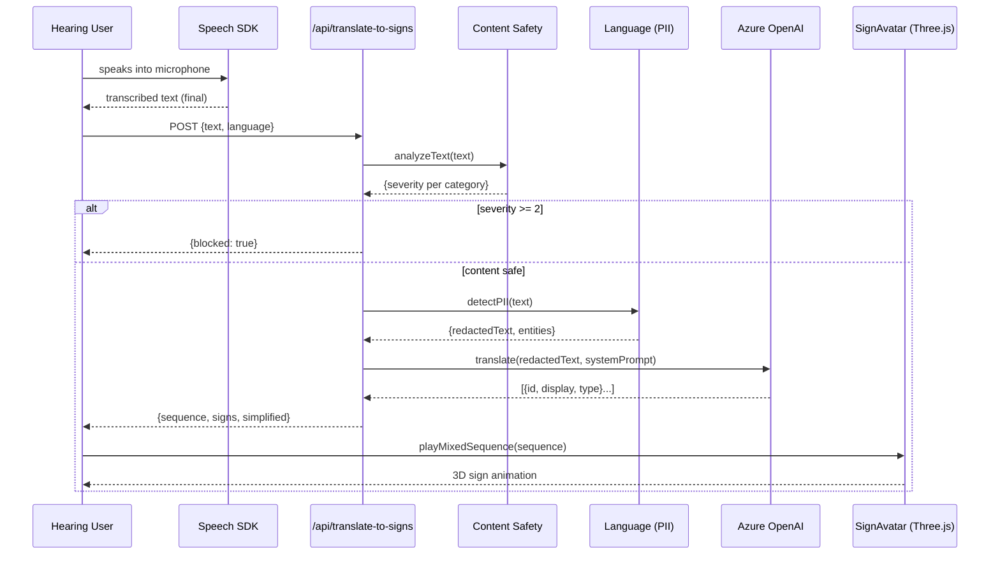
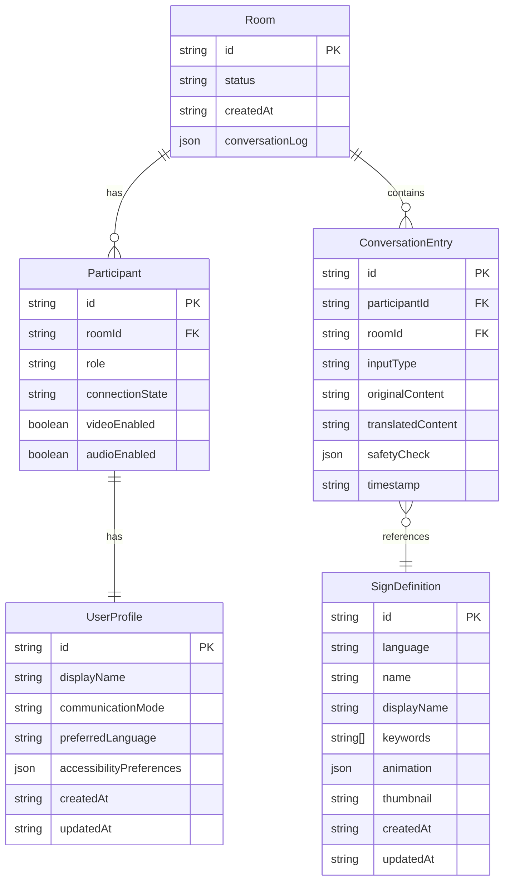

# Azure SignBridge Multimodal — Comprehensive Documentation

> Updated on 2026-03-26. Documents the actual state of the code; sections marked as **[STUB]** correspond to modules with a defined skeleton but no functional implementation.

---

## Table of Contents

1. [Project Overview](#1-project-overview)
2. [System Architecture](#2-system-architecture)
3. [File Structure](#3-file-structure)
4. [Modules and Components](#4-modules-and-components)
5. [Data Models](#5-data-models)
6. [API / Endpoints](#6-api--endpoints)
7. [Requirements and Dependencies](#7-requirements-and-dependencies)
8. [Installation and Configuration](#8-installation-and-configuration)
9. [Available Commands](#9-available-commands)
10. [Main Use Cases](#10-main-use-cases)
11. [Testing](#11-testing)
12. [Deploy and CI/CD](#12-deploy-and-cicd)
13. [Conventions and Standards](#13-conventions-and-standards)
14. [Known Issues and Technical Debt](#14-known-issues-and-technical-debt)

---

## 1. Project Overview

### Name
**Azure SignBridge Multimodal**

### Purpose
A real-time communication platform that eliminates the barrier between deaf people (sign language users) and hearing people (speech users), allowing both to communicate in their native modality within a video call.

### Problem it solves
Deaf or hard-of-hearing people cannot participate in video meetings without a human interpreter. SignBridge acts as a bidirectional automatic interpreter:

- **Speech → Signs:** converts the speaker's audio into text (Azure Speech) and then moves a 3D avatar that executes the corresponding signs in ASL or LSC.
- **Signs → Text:** uses the deaf user's camera to detect hands with MediaPipe, classifies the sign, and displays real-time subtitles.
- **Radical accessibility:** the entire pipeline complies with WCAG 2.1 AA; includes high contrast mode, font size, motion reduction, and subtitle position configuration.

### Full technology stack

| Layer | Technology | Version |
|---|---|---|
| Web Framework | Next.js | 16.2.1 (App Router) |
| UI | React | 18 |
| Language | TypeScript | 5 |
| Styles | Tailwind CSS | 3 |
| UI Animations | Framer Motion | — |
| 3D / Avatar | Three.js | — |
| Hand Tracking | MediaPipe Hands | 0.4 (CDN) |
| Sign Language | Ready Player Me GLB | — |
| AI / LLM | Azure OpenAI (GPT-4o) | API 2024-10-01-preview |
| Voice | Azure Speech SDK | — |
| Translation | Azure Translator | [STUB] |
| Computer Vision | Azure Computer Vision | [STUB] |
| Content Safety | Azure AI Content Safety | — |
| PII Detection | Azure AI Language | — |
| Video Calls | Azure Communication Services | — |
| Real-time | Azure SignalR Service | [STUB integration] |
| Database | Azure Cosmos DB (Core SQL) | — |
| Storage | Azure Blob Storage | — |
| Monitoring | Azure Application Insights | — |
| Infrastructure as Code | Azure Bicep | — |
| Containerization | Docker (Alpine Linux) | Node 20 Alpine |
| Runtime | Node.js | ≥ 20 |
| Package Manager | npm | ≥ 10 |

---

## 2. System Architecture

### Architectural pattern
**Modular monolith with Next.js App Router.** The application combines:
- **SSR / API Routes** for server operations (authentication, Azure integration, database).
- **Rich-client SPA** for the meeting room (real-time hooks, MediaPipe, Three.js).
- **Agents-ready layer** — orchestrated AI agent structure ready to extend (currently a skeleton).

### Architecture diagram

```mermaid
graph TB
    subgraph Browser["User's Browser"]
        direction TB
        RoomPage["Room Page\n(app/room/[id])"]
        AvatarComp["SignAvatar\n(Three.js GLB)"]
        MediaPipe["MediaPipe Hands\n(WASM CDN)"]
        SpeechSDK["Azure Speech SDK\n(dynamic import)"]
        ACSClient["ACS Calling SDK\n(video/audio)"]
        SignalRClient["SignalR Client\n[STUB]"]
    end

    subgraph NextAPI["Next.js API Routes (Server)"]
        direction TB
        SpeechRoute["/api/speech\n(token vending)"]
        SignsRoute["/api/signs\n(CRUD)"]
        TranslateRoute["/api/translate-to-signs\n(GPT-4o pipeline)"]
        SummaryRoute["/api/summary\n(GPT-4o)"]
        RoomsRoute["/api/rooms/join\n(ACS token)"]
        SafetyRoute["/api/safety [STUB]"]
        SignRoute["/api/sign [STUB]"]
        TranslatorRoute["/api/translate [STUB]"]
        ProfileRoute["/api/profile [STUB]"]
    end

    subgraph AzureServices["Azure Services"]
        direction TB
        OpenAI["Azure OpenAI\n(GPT-4o)"]
        Speech["Azure Speech\n(STT + token)"]
        Cosmos["Azure Cosmos DB\n(signs container)"]
        ACSServer["Azure Communication\nServices"]
        SignalR["Azure SignalR\n[STUB]"]
        ContentSafety["Azure Content Safety"]
        Language["Azure Language\n(PII Detection)"]
        Translator["Azure Translator\n[STUB]"]
        Vision["Azure Computer Vision\n[STUB]"]
        Blob["Azure Blob Storage"]
        AppInsights["Application Insights"]
    end

    RoomPage --> SpeechSDK
    RoomPage --> MediaPipe
    RoomPage --> AvatarComp
    RoomPage --> ACSClient
    RoomPage --> SignalRClient

    SpeechSDK -->|"GET /api/speech"| SpeechRoute
    SpeechRoute --> Speech
    RoomPage -->|"POST /api/translate-to-signs"| TranslateRoute
    TranslateRoute --> ContentSafety
    TranslateRoute --> Language
    TranslateRoute --> OpenAI
    RoomPage -->|"POST /api/summary"| SummaryRoute
    SummaryRoute --> OpenAI
    RoomPage -->|"POST /api/rooms/join"| RoomsRoute
    RoomsRoute --> ACSServer
    ACSClient -->|"WebRTC"| ACSServer
    SignalRClient -->|"WebSocket"| SignalR
    SignsRoute --> Cosmos
    AppInsights -.->|"telemetry"| NextAPI
```



### Data flow — Speech → Signs use case



### System layers

| Layer | Files | Responsibility |
|---|---|---|
| **Presentation** | `app/**`, `components/**` | UI, layout, Next.js routing |
| **Hooks** | `hooks/**` | Client state and effects (media, calls, speech) |
| **API Routes** | `app/api/**` | Server-side HTTP endpoints, Azure integration |
| **Lib / Azure** | `lib/azure/**` | Clients and adapters for each Azure service |
| **Lib / Avatar** | `lib/avatar/**` | 3D engine, ASL/LSC keyframes, animation loading |
| **Lib / MediaPipe** | `lib/mediapipe/**` | Hand tracking and sign classification |
| **Lib / Agents** | `lib/agents/**` | AI orchestration (skeleton, not functional) |
| **Types** | `types/index.ts` | Shared TypeScript contracts |
| **Scripts** | `scripts/**` | CLI: verification, seed, asset download |
| **Infrastructure** | `infrastructure/**` | IaC Bicep for Azure provisioning |

---

## 3. File Structure

```
Azure-SignBridge-Multimodal/
│
├── .eslintrc.json               # ESLint: Next.js + TypeScript rules
├── .gitignore                   # Standard Next.js exclusions
├── Dockerfile                   # Production image: Node 20 Alpine, non-root user
├── next.config.mjs              # Next.js: standalone build, security headers
├── package.json                 # Dependencies + npm scripts
├── package-lock.json            # Dependency lock file
├── postcss.config.mjs           # PostCSS with Tailwind plugin
├── tailwind.config.ts           # Tailwind CSS with brand colors
├── tsconfig.json                # TypeScript strict mode, alias @/*→src/*
├── README.md                    # Generic Next.js placeholder
├── DOCUMENTATION.md             # This document
│
├── public/
│   └── models/avatar/
│       └── avatar.glb           # Ready Player Me 3D model (humanoid avatar)
│
├── src/
│   ├── app/                     # Next.js App Router
│   │   ├── layout.tsx           # Root layout: Inter font, global metadata
│   │   ├── page.tsx             # Landing page: hero, features grid, CTA
│   │   ├── globals.css          # CSS variables, global reset, Tailwind base
│   │   ├── favicon.ico
│   │   │
│   │   ├── api/                 # API Routes (server-side)
│   │   │   ├── speech/
│   │   │   │   └── route.ts     # GET: generates Azure Speech token (9 min TTL)
│   │   │   ├── signs/
│   │   │   │   ├── route.ts     # GET list signs / POST create sign (Cosmos DB)
│   │   │   │   └── [id]/
│   │   │   │       └── route.ts # GET/PUT/DELETE one sign; POST duplicates to another language
│   │   │   ├── sign/
│   │   │   │   └── route.ts     # POST: sign recognition from landmarks [STUB]
│   │   │   ├── translate/
│   │   │   │   └── route.ts     # POST: Azure Translator translation [STUB]
│   │   │   ├── translate-to-signs/
│   │   │   │   └── route.ts     # POST: text → sign sequence via GPT-4o + safety
│   │   │   ├── safety/
│   │   │   │   └── route.ts     # POST: content safety analysis [STUB]
│   │   │   ├── summary/
│   │   │   │   └── route.ts     # POST: meeting summary via GPT-4o
│   │   │   ├── profile/
│   │   │   │   └── route.ts     # GET/PUT: user accessibility profile [STUB]
│   │   │   └── rooms/
│   │   │       └── join/
│   │   │           └── route.ts # POST: creates ACS user and returns VoIP token
│   │   │
│   │   ├── room/
│   │   │   ├── new/
│   │   │   │   └── page.tsx     # Redirect: generates UUID and redirects to /room/<uuid>
│   │   │   └── [id]/
│   │   │       └── page.tsx     # Main meeting room (primary component)
│   │   │
│   │   ├── admin/
│   │   │   └── signs/
│   │   │       └── page.tsx     # Admin CRUD for signs (database management)
│   │   │
│   │   └── test/                # Manual test pages (not automated tests)
│   │       ├── avatar/page.tsx           # Avatar render test
│   │       ├── avatar-debug/page.tsx     # Bone and animation debug
│   │       ├── avatar-calibrate/page.tsx # Pose calibration
│   │       ├── sign/page.tsx             # Sign recognition test
│   │       └── speech/page.tsx           # Speech recognition test
│   │
│   ├── components/              # React Client Components
│   │   ├── SignAvatar.tsx        # 3D avatar wrapper: loading, error, animated label
│   │   ├── VideoStream.tsx       # ACS video stream rendering
│   │   ├── TranscriptionOverlay.tsx  # Real-time subtitle overlay
│   │   ├── ChatPanel.tsx         # Message history panel
│   │   ├── OnboardingModal.tsx   # Communication mode selection modal
│   │   ├── SessionSummary.tsx    # Summary on session end
│   │   ├── MeetingSummary.tsx    # GPT-4o summary visualization
│   │   ├── ResponsibleAIPanel.tsx # AI transparency panel (metrics)
│   │   ├── AccessibilityPanel.tsx # Accessibility settings panel
│   │   ├── SignRecognizer.tsx    # Hand detection visualization overlay
│   │   └── admin/
│   │       └── PhotoCalibrator.tsx  # Avatar pose calibration tool
│   │
│   ├── hooks/                   # Custom React Hooks (client)
│   │   ├── useSpeechRecognition.ts  # Azure Speech: continuous recognition
│   │   ├── useSignRecognition.ts    # MediaPipe + sign classification
│   │   ├── useAcsCalling.ts         # Azure ACS: group video call
│   │   ├── useAccessibility.ts      # User accessibility profile [STUB]
│   │   └── useSignalR.ts            # SignalR Hub connection [STUB]
│   │
│   ├── lib/                     # Business logic without React
│   │   ├── azure/               # Azure service clients
│   │   │   ├── openai.ts        # AzureOpenAI client factory
│   │   │   ├── speech.ts        # Recognizer builder + token types
│   │   │   ├── translator.ts    # Azure Translator client [STUB]
│   │   │   ├── vision.ts        # Computer Vision client [STUB]
│   │   │   ├── content-safety.ts # Text analysis (4 categories, severity threshold ≥ 2)
│   │   │   ├── pii-detection.ts # PII detection and redaction (API v3.1)
│   │   │   ├── cosmos.ts        # Cosmos DB singleton client
│   │   │   ├── signs-db.ts      # Signs CRUD: getAllSigns, getSign, createSign, etc.
│   │   │   ├── communication.ts # ACS initialization [STUB]
│   │   │   └── signalr.ts       # SignalR negotiation [STUB]
│   │   │
│   │   ├── mediapipe/           # Hand tracking and recognition
│   │   │   ├── hand-tracker.ts  # Loads MediaPipe from CDN, draws 21-landmark skeleton on canvas
│   │   │   └── sign-classifier.ts # Rule-based classification (13 static hand shapes)
│   │   │
│   │   ├── avatar/              # 3D avatar engine and animation base
│   │   │   ├── avatar-engine.ts      # Three.js: loads GLB, interpolates keyframes, idle, blink
│   │   │   ├── sign-core.ts          # Types: FingerRotation, HandPose, ArmPose, AvatarKeyframe
│   │   │   ├── sign-animations.ts    # Barrel: exports all animations + helpers
│   │   │   ├── sign-animations-asl.ts # 38+ ASL signs with full keyframes (~38KB)
│   │   │   ├── sign-animations-lsc.ts # LSC (Colombian Sign Language): vocabulary + full alphabet
│   │   │   ├── sign-animations-lsb.ts # LSB (Brazilian Sign Language): 73 signs + 26 letters + 98 mappings
│   │   │   ├── sign-loader.ts        # Selects ASL / LSC / LSB based on UI language
│   │   │   ├── sign-languages.ts     # Mapping UI language → sign language (3 languages)
│   │   │   └── sign-db-loader.ts     # Cosmos DB SignDefinition → SignAnimation
│   │   │
│   │   └── agents/              # AI orchestration (skeleton, not functional)
│   │       ├── orchestrator.ts  # Event-driven pipeline [STUB]
│   │       ├── sign-agent.ts    # Landmarks → translation [STUB]
│   │       ├── speech-agent.ts  # Audio → transcription [STUB]
│   │       ├── safety-agent.ts  # Content filtering [STUB]
│   │       └── summary-agent.ts # Meeting summary [STUB]
│   │
│   └── types/
│       └── index.ts             # Central TypeScript type registry (200+ lines)
│
├── scripts/
│   ├── tsconfig.json            # TypeScript config for scripts (CommonJS)
│   ├── verify-azure.ts          # Health check for 11 Azure services (500+ lines)
│   ├── download-avatar.ts       # Downloads GLB model from CDN/API
│   ├── seed-signs.ts            # Seeds Cosmos DB with initial sign data
│   └── inspect-avatar.ts        # Inspects GLB skeleton (bone names)
│
└── infrastructure/
    ├── main.bicep               # IaC: all Azure resource definitions (~1000 lines)
    ├── parameters.dev.json      # Parameters for development environment
    ├── parameters.prod.json     # Parameters for production (higher capacity)
    ├── deploy.sh                # Bash script: runs az deployment group create
    └── deploy-app.sh            # Bash script: deploys the application to the resource
```

**Naming conventions:**
- React component files: `PascalCase.tsx`
- Hooks: `useCamelCase.ts`
- Library modules: `kebab-case.ts`
- API routes: kebab-case folders with `route.ts` inside
- Scripts: `kebab-case.ts`

---

## 4. Modules and Components

### 4.1 App Router (`src/app/`)

| Component | Responsibility |
|---|---|
| `layout.tsx` | Provides Inter font, `<head>` metadata, global wrapper |
| `page.tsx` | Marketing landing page with hero, feature cards, and CTA button |
| `room/new/page.tsx` | Generates UUID with `crypto.randomUUID()` and redirects to `/room/<uuid>` |
| `room/[id]/page.tsx` | Orchestrates the entire room: hooks, state, two-column layout, modals |
| `admin/signs/page.tsx` | Sign CRUD for administrators; uses `/api/signs` |
| `test/*/page.tsx` | Isolated manual test pages for each subsystem |

### 4.2 React Components (`src/components/`)

| Component | Key Props | Responsibility |
|---|---|---|
| `SignAvatar` | `skinTone, speed, onSignStart, onSignEnd` | `AvatarEngine` wrapper; exposes ref with methods `playSign`, `playSequence`, `fingerspell`, `playMixedSequence`, `setSkinTone`, `setSpeed`, `setStaticPose` |
| `TranscriptionOverlay` | — | Displays live subtitles (final + interim text) over the video |
| `ChatPanel` | — | History of `ConversationEntry[]` with type icons and safety status |
| `OnboardingModal` | — | Mode selection (`speak` / `sign` / `text`) when entering a room |
| `SessionSummary` | — | Final modal with GPT-4o summary, topics, and action items |
| `MeetingSummary` | — | Card with summary, topics[], and actionItems[] |
| `ResponsibleAIPanel` | — | Displays `ResponsibleAIMetrics`: checks, filtered, PII redacted, score |
| `AccessibilityPanel` | — | Controls for high contrast, font size, subtitle position, avatar skin tone |
| `VideoStream` | — | Renders ACS `RemoteVideoStream` in a `<video>` element |
| `SignRecognizer` | — | Overlays hand skeleton canvas on top of the camera feed |
| `admin/PhotoCalibrator` | — | Allows setting static avatar poses to capture keyframes |

**Component dependencies:**
- `room/[id]/page.tsx` imports and orchestrates all other components
- `SignAvatar` depends on `AvatarEngine` (dynamic import)
- `SignRecognizer` depends on `hand-tracker.ts`

### 4.3 Custom Hooks (`src/hooks/`)

#### `useSpeechRecognition(language: string)`
- **State:** `isListening`, `isLoading`, `transcript`, `interimText`, `error`
- **Methods:** `startListening()`, `stopListening()`, `clearTranscript()`
- **Flow:** Fetches token from `/api/speech` → dynamically imports Speech SDK → builds `SpeechRecognizer` → accumulates final text; displays interim text while the user speaks → renews token before expiry (every 9 min)
- **Depends on:** `lib/azure/speech.ts`, `/api/speech`

#### `useSignRecognition()`
- **State:** `isDetecting`, `isLoading`, `currentSign`, `currentEmoji`, `confidence`, `handsDetected`, `fps`, `fingerState`, `error`
- **Methods:** `start(videoEl, canvasEl)`, `stop()`
- **Flow:** Loads MediaPipe from CDN → processes frames at 30 FPS → classifies hand shape → 500ms debounce (sign must be held) → emits `currentSign`
- **Depends on:** `lib/mediapipe/hand-tracker.ts`, `lib/mediapipe/sign-classifier.ts`

#### `useAcsCalling(roomId, startCall, onMessageReceived)`
- **State:** `call`, `remoteStreams[]`, `localVideoStream`, `error`
- **Methods:** `toggleMic(mute)`, `toggleCam(turnOff)`, `sendData(payload)`
- **Flow:** Calls `/api/rooms/join` → initializes `CallClient` + `DeviceManager` → joins group with `groupId=roomId` → subscribes to remote streams → DataChannel (channelId: 100) for data messages
- **Depends on:** `@azure/communication-calling`, `/api/rooms/join`

#### `useAccessibility()` [STUB]
- **State:** `profile` (hardcoded default values)
- **TODO:** Persist to `/api/profile` (Cosmos DB)

#### `useSignalR(roomId)` [STUB]
- **Purpose:** SignalR connection for real-time broadcast
- **TODO:** Implement `HubConnectionBuilder`, subscribe to events

### 4.4 Azure Library (`src/lib/azure/`)

| Module | Status | Responsibility |
|---|---|---|
| `openai.ts` | ✅ | `createOpenAIClient()` factory → `AzureOpenAI` with env vars |
| `speech.ts` | ✅ | `buildSpeechRecognizer(token, region, lang)` + token types |
| `content-safety.ts` | ✅ | `analyzeTextSafety(text)` → categories + severity |
| `pii-detection.ts` | ✅ | `detectAndRedactPII(text, lang)` → redacted text + entities |
| `cosmos.ts` | ✅ | `CosmosClient` singleton + DB/container references |
| `signs-db.ts` | ✅ | Full CRUD over `signs` container |
| `communication.ts` | [STUB] | ACS initialization |
| `signalr.ts` | [STUB] | SignalR negotiation |
| `translator.ts` | [STUB] | Azure Translator |
| `vision.ts` | [STUB] | Azure Computer Vision |

### 4.5 Avatar Engine (`src/lib/avatar/`)

| Module | Responsibility |
|---|---|
| `avatar-engine.ts` | Three.js engine: loads GLB, keyframe system, idle breathing, blink, playback queue |
| `sign-core.ts` | Types: `FingerRotation`, `HandPose`, `ArmPose`, `AvatarKeyframe`, `SignAnimation` |
| `sign-animations-asl.ts` | 38+ ASL signs with full keyframes + `WORD_TO_SIGN_ASL` map |
| `sign-animations-lsc.ts` | LSC (Colombian Sign Language): extended vocabulary + full alphabet (1736 lines) |
| `sign-animations-lsb.ts` | LSB (Brazilian Sign Language): 73 lexical signs + 26 letters (letra_a…letra_z) + 98 `WORD_TO_SIGN_LSB` mappings (1299 lines) |
| `sign-animations.ts` | Export barrel + interpolation helpers |
| `sign-loader.ts` | Selects ASL / LSC / LSB based on UI language |
| `sign-languages.ts` | Mapping: UI language code → `SignLanguageCode` ("ASL" \| "LSC" \| "LSB") — en-US→ASL, es-CO→LSC, pt-BR→LSB, es-ES→ASL |
| `sign-db-loader.ts` | Converts Cosmos DB `SignDefinition` to `SignAnimation` |

**AvatarEngine capabilities:**
- Skeleton: 4 bones per arm × 2 + 3 joints × 5 fingers × 2 + spine + head
- Smooth interpolation between keyframes with easing
- Natural return to rest 500ms after the last sign
- Micro finger oscillation at rest (lifelike effect)
- Idle breathing (slight spine oscillation)
- Blinking via morph targets (`eyeBlinkLeft`, `eyeBlinkRight`)
- Animation queue for smooth chaining
- Speed multiplier (0.3×–3×)
- Skin color tint (light/medium/dark)

### 4.6 MediaPipe (`src/lib/mediapipe/`)

| Module | Responsibility |
|---|---|
| `hand-tracker.ts` | Loads MediaPipe Hands 0.4 from CDN (WASM 8MB), draws 21-landmark skeleton on canvas |
| `sign-classifier.ts` | Rule-based classification: detects finger extension → 13 static hand shapes |

**Recognized signs:** Fist, Thumbs Up, Peace/Victory, Open Hand (5), ILY, Point Up, and other static shapes. Confidence: Hamming similarity ≥ 80%.

---

## 5. Data Models

### 5.1 Cosmos DB — Container `signs`

```
Database: signbridge (configurable via AZURE_COSMOS_DATABASE)
Container: signs
Partition key: /language
```

**`SignDefinition` document:**
```typescript
{
  id: string,              // Auto-generated UUID
  language: string,        // "ASL" | "LSC" — partition key
  name: string,            // Sign name (e.g. "hello")
  displayName: string,     // Display name (e.g. "Hello / Hola")
  keywords: string[],      // For search (e.g. ["hi", "greeting"])
  animation: {             // Full animation keyframes
    keyframes: AvatarKeyframe[],
    duration: number
  },
  thumbnail?: string,      // URL in Azure Blob Storage
  createdAt: string,       // ISO timestamp
  updatedAt: string        // ISO timestamp
}
```

**Operations available in `signs-db.ts`:**
- `getAllSigns(language?)` — SQL: `SELECT * FROM c WHERE c.language = @lang ORDER BY c.name`
- `getSign(id)` — Point fetch (id + partition key)
- `createSign(sign)` — Insert with automatic timestamps
- `updateSign(id, updates)` — Merge + updates `updatedAt`
- `deleteSign(id)` — Delete by point
- `searchByKeyword(keyword, language?)` — `ARRAY_CONTAINS(c.keywords, @kw)`
- `duplicateSign(id, targetLanguage)` — Copies with new id and partition key

### 5.2 Main TypeScript types (`src/types/index.ts`)

```typescript
// Accessibility preferences
interface AccessibilityPreferences {
  highContrast: boolean;
  fontSize: "small" | "medium" | "large" | "x-large";
  reduceMotion: boolean;
  captionsEnabled: boolean;
  signAvatarEnabled: boolean;
  speechRate: number;           // 0.5 - 2.0
  voicePreference: string;
}

// User profile
interface UserProfile {
  id: string;
  displayName: string;
  communicationMode: "speech" | "sign" | "text";
  preferredLanguage: string;   // BCP-47 (e.g. "en-US")
  accessibilityPreferences: AccessibilityPreferences;
  createdAt: string;
  updatedAt: string;
}

// Conversation entry
interface ConversationEntry {
  id: string;
  participantId: string;
  timestamp: string;
  inputType: "speech" | "sign" | "text";
  originalContent: string;
  translatedContent: string;
  simplifiedContent?: string;
  sentiment?: SentimentResult;
  safetyCheck: SafetyCheckResult;
}

// Safety result
interface SafetyCheckResult {
  isAllowed: boolean;
  categories: { hate: number; sexual: number; violence: number; selfHarm: number };
  piiDetected: string[];
  explanation: string;
}

// Meeting summary
interface MeetingSummary {
  roomId: string;
  duration: number;            // milliseconds
  participantCount: number;
  keyTopics: string[];
  actionItems: string[];
  fullTranscript: ConversationEntry[];
  accessibleSummary: string;
  generatedAt: string;
  responsibleAIMetrics: ResponsibleAIMetrics;
}

// Responsible AI metrics
interface ResponsibleAIMetrics {
  contentSafetyChecks: number;
  contentFiltered: number;
  piiRedacted: number;
  averageConfidence: number;
  transparencyScore: number;   // 0-1
}

// SignalR message types (discriminated union)
type SignalRMessageType =
  | "transcription"
  | "sign_detected"
  | "translation"
  | "avatar_command"
  | "safety_alert"
  | "participant_update";
```

### 5.3 Simplified ER diagram



> Note: Only `SignDefinition` is currently persisted in Cosmos DB. `Room`, `Participant`, and `ConversationEntry` exist as TypeScript types but without implemented persistence.

---

## 6. API / Endpoints

### Authentication
No user authentication is currently implemented. API routes are public (any client can call them). Azure credentials are only accessed from the server via environment variables.

### Endpoints summary

| Method | Path | Status | Description |
|---|---|---|---|
| GET | `/api/speech` | ✅ | Azure Speech token for the client |
| GET | `/api/signs` | ✅ | List of signs (with optional filter) |
| POST | `/api/signs` | ✅ | Create new sign |
| GET | `/api/signs/[id]` | ✅ | Get sign by ID |
| PUT | `/api/signs/[id]` | ✅ | Update sign |
| DELETE | `/api/signs/[id]` | ✅ | Delete sign |
| POST | `/api/signs/[id]?action=duplicate` | ✅ | Duplicate sign to another language |
| POST | `/api/translate-to-signs` | ✅ | Text → sign sequence (GPT-4o) |
| POST | `/api/summary` | ✅ | Meeting summary (GPT-4o) |
| POST | `/api/rooms/join` | ✅ | ACS token for video call |
| POST | `/api/safety` | [STUB] | Content analysis |
| POST | `/api/translate` | [STUB] | Text translation |
| POST | `/api/sign` | [STUB] | Sign recognition |
| GET | `/api/profile` | [STUB] | Accessibility profile |
| PUT | `/api/profile` | [STUB] | Update profile |

---

### Functional endpoint details

#### `GET /api/speech`
Vends an Azure Speech token to the client. The token has a 9-minute TTL.

**Response 200:**
```json
{
  "token": "eyJ...",
  "region": "eastus2",
  "expiresAt": 1711234567000
}
```
**Errors:** 500 if `AZURE_SPEECH_KEY` or `AZURE_SPEECH_REGION` are not configured.

---

#### `GET /api/signs`
Lists signs from the Cosmos DB container.

**Query params:**
| Parameter | Type | Description |
|---|---|---|
| `language` | string | Filter by sign language (e.g. `ASL`, `LSC`) |
| `q` | string | Keyword search |

**Response 200:** `SignDefinition[]`

---

#### `POST /api/signs`
Creates a new sign.

**Body:** `SignDefinition` (without `id`, `createdAt`, `updatedAt`)

**Response 201:** Created `SignDefinition`

---

#### `GET /api/signs/[id]`
Gets a sign by ID.

**Path param:** `id` (UUID)

**Response 200:** `SignDefinition`

**Errors:** 404 if not found.

---

#### `PUT /api/signs/[id]`
Updates sign fields (partial merge).

**Body:** Partial `SignDefinition`

**Response 200:** Updated `SignDefinition`

---

#### `DELETE /api/signs/[id]`
Deletes a sign.

**Response 204:** No body

---

#### `POST /api/signs/[id]?action=duplicate&language=LSC`
Duplicates a sign to another sign language.

**Query params:**
| Parameter | Type | Description |
|---|---|---|
| `action` | `"duplicate"` | Required action |
| `language` | string | Target language (e.g. `LSC`) |

**Response 201:** New `SignDefinition` with the target language

---

#### `POST /api/translate-to-signs` ⭐
Full translation pipeline with safety.

**Body:**
```json
{
  "text": "Hello, how are you?",
  "language": "en-US"
}
```

**Internal pipeline:**
1. `analyzeTextSafety(text)` → blocks if any category ≥ severity 2
2. `detectAndRedactPII(text)` → replaces personal data with `[REDACTED]`
3. GPT-4o with a system prompt specialized in sign language grammar
4. JSON output validation and fallback to local mapping if GPT fails

**Response 200:**
```json
{
  "sequence": [
    { "type": "sign", "id": "hello", "display": "Hello" },
    { "type": "spell", "word": "how", "display": "H-O-W" }
  ],
  "signs": ["hello", "you"],
  "simplified": "Hello you",
  "original": "Hello, how are you?",
  "safetyCheck": {
    "hate": 0, "sexual": 0, "violence": 0, "selfHarm": 0,
    "piiRedacted": 0
  }
}
```

**Response 200 (blocked):**
```json
{
  "blocked": true,
  "reason": "Content safety threshold exceeded",
  "categories": { "hate": 4, "sexual": 0, "violence": 0, "selfHarm": 0 }
}
```

---

#### `POST /api/summary` ⭐
Generates an accessible meeting summary using GPT-4o.

**Body:**
```json
{
  "conversationLog": [ConversationEntry],
  "sessionDuration": 3600000,
  "signsCount": 45,
  "wordsCount": 320,
  "safetyCount": 5,
  "piiCount": 2
}
```

**Response 200:**
```json
{
  "summary": "In this meeting, we discussed...",
  "topics": ["2026 Budget", "Design team"],
  "actionItems": ["Send proposal to John", "Review mockups"],
  "tone": "professional"
}
```

**Fallback:** If GPT-4o is unavailable, returns basic session statistics.

---

#### `POST /api/rooms/join` ⭐
Creates an ACS identity and returns video call credentials.

**Body:** `{}` (empty; roomId comes from room context)

**Response 200:**
```json
{
  "communicationUserId": "8:acs:abc123...",
  "token": "eyJhbGciOi...",
  "expiresOn": "2026-03-26T15:00:00.000Z"
}
```

**Errors:** 500 if `ACS_CONNECTION_STRING` is not configured.

---

## 7. Requirements and Dependencies

### System requirements
- **Node.js:** ≥ 20
- **npm:** ≥ 10
- **Operating System:** Linux, macOS or Windows (WSL2)
- **GPU:** Not required (Three.js uses browser WebGL)
- **Browser:** Chrome/Edge 90+ (MediaPipe WASM + WebGL + WebRTC)

### Required Azure services
| Service | Purpose |
|---|---|
| Azure OpenAI (GPT-4o deployment) | Text → signs translation, meeting summary |
| Azure Speech Services | Continuous STT, token vending |
| Azure Cosmos DB | Signs database |
| Azure Communication Services | Group video call + identity token |

### Optional Azure services (currently stubs)
| Service | Purpose |
|---|---|
| Azure AI Content Safety | Message safety check |
| Azure AI Language | PII detection and redaction |
| Azure SignalR | Real-time broadcast between participants |
| Azure Translator | Multilingual translation |
| Azure Computer Vision | Image analysis |
| Azure Blob Storage | Avatar assets and thumbnails |
| Azure Application Insights | Telemetry and monitoring |

### Production dependencies (package.json)

| Package | Purpose |
|---|---|
| `next` | SSR web framework + App Router |
| `react`, `react-dom` | UI library |
| `typescript` | Typed language |
| `tailwindcss` | Utility-first styles |
| `framer-motion` | UI animations |
| `three` | 3D avatar rendering |
| `@azure/openai` | Azure OpenAI client (GPT-4o) |
| `microsoft-cognitiveservices-speech-sdk` | Azure Speech SDK |
| `@azure/cosmos` | Cosmos DB client |
| `@azure/communication-calling` | ACS video calling SDK |
| `@azure/communication-common` | Common ACS types |
| `@azure/communication-identity` | ACS user creation |
| `@azure/ai-text-analytics` | Language service (PII detection) |
| `@azure/storage-blob` | Azure Blob Storage SDK |
| `@microsoft/signalr` | SignalR client (v10) |
| `@gltf-transform/core` | GLB model processing/transformation |
| `@gltf-transform/extensions` | GLTF processor extensions |

### Development dependencies

| Package | Purpose |
|---|---|
| `@types/node`, `@types/react` | TypeScript types |
| `@types/three` | Three.js types |
| `eslint`, `eslint-config-next` | Linting |
| `tsx` | Runs TypeScript scripts directly |
| `postcss` | CSS processing (required by Tailwind) |
| `dotenv` | Loads `.env` in Node scripts (verify-azure, seed-signs) |

### Environment variables

All variables must be in `.env.local`. Copy `.env.local.example` as a base.

| Variable | Required | Description |
|---|---|---|
| `AZURE_OPENAI_ENDPOINT` | ✅ | Azure OpenAI resource URL |
| `AZURE_OPENAI_KEY` | ✅ | Azure OpenAI API key |
| `AZURE_OPENAI_DEPLOYMENT` | ✅ | GPT-4o deployment name |
| `AZURE_SPEECH_KEY` | ✅ | Speech Services subscription key |
| `AZURE_SPEECH_REGION` | ✅ | Region (e.g. `eastus2`) |
| `AZURE_COSMOS_ENDPOINT` | ✅ | Cosmos DB account URL |
| `AZURE_COSMOS_KEY` | ✅ | Cosmos DB primary key |
| `AZURE_COSMOS_DATABASE` | ✅ | Database name (default: `signbridge`) |
| `ACS_CONNECTION_STRING` | ✅ | Azure Communication Services connection string |
| `AZURE_CONTENT_SAFETY_ENDPOINT` | ⚠️ | Content Safety resource URL |
| `AZURE_CONTENT_SAFETY_KEY` | ⚠️ | Content Safety API key |
| `AZURE_LANGUAGE_ENDPOINT` | ⚠️ | Azure Language resource URL (PII) |
| `AZURE_LANGUAGE_KEY` | ⚠️ | Azure Language API key |
| `AZURE_SIGNALR_CONNECTION_STRING` | ⚠️ | SignalR connection string [STUB] |
| `AZURE_COMMUNICATION_CONNECTION_STRING` | ⚠️ | Alternative to `ACS_CONNECTION_STRING` |
| `AZURE_TRANSLATOR_KEY` | ⚠️ | Azure Translator API key [STUB] |
| `AZURE_TRANSLATOR_REGION` | ⚠️ | Translator region [STUB] |
| `AZURE_VISION_ENDPOINT` | ⚠️ | Computer Vision URL [STUB] |
| `AZURE_VISION_KEY` | ⚠️ | Computer Vision API key [STUB] |
| `AZURE_STORAGE_CONNECTION_STRING` | ⚠️ | Blob Storage connection string [STUB] |
| `AZURE_STORAGE_CONTAINER` | ⚠️ | Container name (default: `signbridge-assets`) |
| `APPLICATIONINSIGHTS_CONNECTION_STRING` | ⚠️ | App Insights connection string |
| `NEXT_PUBLIC_SIGNALR_URL` | ⚠️ | SignalR hub URL (exposed to client) |

✅ = required for core functionality · ⚠️ = required for specific features

---

## 8. Installation and Configuration

### Step 1: Clone the repository
```bash
git clone <repo-url>
cd Azure-SignBridge-Multimodal
```

### Step 2: Install dependencies
```bash
npm install
```

### Step 3: Configure environment variables
```bash
cp .env.local.example .env.local
# Edit .env.local with real Azure credentials
```

### Step 4: Provision Azure resources (optional — if they don't exist)
```bash
cd infrastructure

# Install Azure CLI if not installed
# https://docs.microsoft.com/en-us/cli/azure/install-azure-cli

az login

# Create resource group
az group create --name signbridge-rg --location eastus2

# Deploy infrastructure (dev environment)
./deploy.sh dev
```

### Step 5: Download avatar model
```bash
npm run download-avatar
# Downloads avatar.glb to public/models/avatar/
```

### Step 6: Create database and container in Cosmos DB
The `signs` container with partition key `/language` must be created manually or via the Azure portal, or is created automatically by Bicep.

### Step 7: Seed initial signs
```bash
npm run seed-signs
# Loads initial ASL/LSC animations into Cosmos DB
```

### Step 8: Verify Azure connectivity
```bash
npm run verify:azure
# Checks all 11 services and shows OK/FAIL/SKIP status
```

### Step 9: Start in development
```bash
npm run dev
# Available at http://localhost:3000
```

### Configuration notes
- The `avatar.glb` model (Ready Player Me) **must exist** at `public/models/avatar/avatar.glb` before starting
- MediaPipe Hands loads from CDN on first use (requires internet connection)
- Azure Speech SDK (~2MB) loads dynamically on first use

---

## 9. Available Commands

| Command | Script | When to use |
|---|---|---|
| `npm run dev` | `next dev` | Local development with hot reload |
| `npm run build` | `next build` | Production build (generates `.next/standalone`) |
| `npm run start` | `next start` | Run production build locally |
| `npm run lint` | `next lint` | Check ESLint rules |
| `npm run verify:azure` | `tsx scripts/verify-azure.ts` | Verify connectivity with all Azure services |
| `npm run download-avatar` | `tsx scripts/download-avatar.ts` | Download avatar GLB model |
| `npm run seed-signs` | `tsx scripts/seed-signs.ts` | Seed Cosmos DB with initial signs |

### Infrastructure commands (`infrastructure/`)

```bash
# Full infrastructure deploy
./deploy.sh [dev|prod]

# Application-only deploy (without recreating infrastructure)
./deploy-app.sh [dev|prod]
```

### Docker commands

```bash
# Build image
docker build -t signbridge .

# Run (requires .env with Azure variables)
docker run -p 3000:3000 --env-file .env.local signbridge
```

---

## 10. Main Use Cases

### UC-01: Hearing user speaks → Deaf user sees signs

**Actor:** Hearing user (without hearing impairment)
**Precondition:** Room created, user in `speech` mode, microphone available
**Flow:**
1. User navigates to `/room/<uuid>` and selects `speak` mode in the onboarding modal
2. `useSpeechRecognition` hook fetches token from `/api/speech` and starts continuous recognition
3. Azure Speech SDK transcribes audio in real time; interim text appears in `TranscriptionOverlay`
4. When a phrase ends, the final text is sent to `POST /api/translate-to-signs`
5. The pipeline checks safety → redacts PII → GPT-4o generates sign sequence
6. The `sequence[]` response is passed to `SignAvatar` which executes `playMixedSequence()`
7. The 3D avatar performs the signs; each sign shows its label for 1s

**Expected result:** The deaf participant sees the avatar performing the hearing user's signs in real time.

**Alternative flow — blocked content:** If the safety check returns `blocked: true`, the avatar does not animate and a filtered content indicator appears in the `ResponsibleAIPanel`.

---

### UC-02: Deaf user signs → Hearing user reads subtitles

**Actor:** Deaf user (uses sign language)
**Precondition:** Room created, camera available, user in `sign` mode
**Flow:**
1. User selects `sign` mode in onboarding
2. `useSignRecognition` hook loads MediaPipe and starts processing camera frames
3. `SignRecognizer` shows hand skeleton overlay in real time
4. When a sign is detected with confidence ≥ 80% for 500ms: `currentSign` is updated
5. The sign text appears in `TranscriptionOverlay` for other participants
6. [FUTURE] The text would be sent via SignalR to other participants

**Expected result:** Other participants read the deaf user's signs as subtitles.

---

### UC-03: Create room and join video call

**Actor:** Any user
**Precondition:** Server running, ACS configured
**Flow:**
1. User navigates to the landing page and clicks "Start Meeting"
2. `room/new/page.tsx` generates a UUID and redirects to `/room/<uuid>`
3. The room component calls `POST /api/rooms/join` to get the ACS token
4. `useAcsCalling` hook initializes the `CallClient` and joins the group with `groupId=roomId`
5. Local camera activates; remote participants appear in `VideoStream` components
6. DataChannel (channelId: 100) becomes available for data messages between participants

**Expected result:** Active video call with multiple participants, bidirectional audio and video.

---

### UC-04: End session and view summary

**Actor:** Any participant
**Precondition:** Active session with at least one `ConversationEntry` in the log
**Flow:**
1. User clicks "End Session"
2. The room sends `POST /api/summary` with the full `conversationLog[]` and metrics
3. GPT-4o generates an accessible summary with plain language + topics + action items
4. `SessionSummary` component displays the summary, responsible AI metrics, and statistics
5. The `ResponsibleAIPanel` shows how many safety checks were done, how much was filtered, PII redacted

**Expected result:** Readable meeting summary with AI transparency metrics.

---

### UC-05: Manage sign database

**Actor:** Administrator
**Precondition:** Access to `/admin/signs`, Cosmos DB configured
**Flow:**
1. Admin navigates to `/admin/signs`
2. List of ASL and LSC signs loaded from `GET /api/signs`
3. Admin can create new sign via `POST /api/signs` (with defined keyframes)
4. Admin can edit via `PUT /api/signs/[id]`
5. Admin can duplicate sign to another language via `POST /api/signs/[id]?action=duplicate&language=LSC`
6. Admin can use `PhotoCalibrator` to capture avatar poses in real time

**Expected result:** Updated sign database available to all users.

---

## 11. Testing

### Strategy
No automated tests exist in the project (no `*.test.ts`, `*.spec.ts` files or Jest/Vitest/Playwright configuration were found).

### Manual test pages
The project includes 5 manual test pages in `src/app/test/`:

| Route | Purpose |
|---|---|
| `/test/avatar` | Basic avatar GLB rendering |
| `/test/avatar-debug` | Bone, morph target, and animation inspection |
| `/test/avatar-calibrate` | Static pose capture and adjustment |
| `/test/sign` | MediaPipe sign classifier test |
| `/test/speech` | Azure Speech recognition test |

### Verification script
```bash
npm run verify:azure
```
Verifies connectivity and basic functionality of all 11 Azure services. Not an automated integration test, but serves as a smoke test for the environment.

### Recommendations for future testing
- **Unit tests:** `sign-classifier.ts` (landmark classification), `signs-db.ts` (SQL queries), `content-safety.ts`
- **Integration tests:** API routes with Cosmos DB, `translate-to-signs` pipeline
- **E2E tests:** Full room flow with Playwright (requires mocking Azure Speech and MediaPipe)
- **Current coverage:** 0% (cannot be determined, no tests exist)

---

## 12. Deploy and CI/CD

### CI/CD
No CI/CD configuration was found (no `.github/workflows/`, `.gitlab-ci.yml`, or similar). Deployment is manual via Bash scripts.

### Manual deploy process

#### Infrastructure (first time or Bicep changes)
```bash
cd infrastructure
az login
az group create --name signbridge-rg-[dev|prod] --location eastus2
./deploy.sh [dev|prod]
```

The `main.bicep` creates/updates all Azure resources:
- Log Analytics Workspace
- Application Insights
- Key Vault (RBAC, soft-delete)
- Azure OpenAI
- Azure Speech Services
- Azure Cosmos DB
- Azure Communication Services
- Azure SignalR
- Azure Blob Storage
- Azure Language
- Azure Content Safety
- App Service or Container Instance (for the application)

#### Application (deploy new version)
```bash
npm run build          # Generates .next/standalone
./infrastructure/deploy-app.sh [dev|prod]
```

#### Containerization
```bash
docker build -t signbridge:latest .
# Push to Azure Container Registry
docker tag signbridge:latest <acr-name>.azurecr.io/signbridge:latest
docker push <acr-name>.azurecr.io/signbridge:latest
```

### Environments
| Environment | Parameters | SKUs |
|---|---|---|
| `dev` | `parameters.dev.json` | Minimum (lower cost) |
| `prod` | `parameters.prod.json` | High availability, higher log retention |

### Resource naming convention
```
signbridge-{resource}-{environment}
e.g.: signbridge-openai-dev, signbridge-cosmos-prod
```

### Azure resource tags
```json
{
  "project": "SignBridge",
  "challenge": "hackathon",
  "env": "[dev|prod]"
}
```

---

## 13. Conventions and Standards

### Code style
- **TypeScript strict mode** (`"strict": true` in tsconfig.json)
- **ESLint** with `eslint-config-next` and TypeScript rules
- **No Prettier** configured (not found)
- **Path aliases:** `@/*` → `src/*` (avoids deep relative imports)

### TypeScript conventions
- Interfaces for domain objects (not `type` aliases)
- `discriminated unions` for polymorphic SignalR messages
- Dynamic imports for heavy modules (Speech SDK, AvatarEngine)
- `'use client'` directive on all components with hooks or browser events

### Component conventions
- Components with forwardRef to expose imperative methods (`SignAvatar`)
- Custom hooks encapsulate all complex state logic
- No prop drilling: each component gets what it needs from the corresponding hook

### Identified design patterns
- **Singleton:** `cosmos.ts` (Cosmos DB client), `openai.ts` (OpenAI client)
- **Factory:** `speech.ts` (`buildSpeechRecognizer`)
- **Facade:** `signs-db.ts` (hides Cosmos DB queries)
- **Adapter:** `sign-db-loader.ts` (Cosmos DB → SignAnimation)
- **Strategy:** `sign-loader.ts` (selects ASL vs LSC animations)
- **Fail-open:** Content Safety and PII detection — if the service fails, content is allowed

### Security — HTTP Headers (next.config.mjs)
```
X-Content-Type-Options: nosniff
X-Frame-Options: DENY
X-XSS-Protection: 1; mode=block
Referrer-Policy: strict-origin-when-cross-origin
Strict-Transport-Security: max-age=63072000; includeSubDomains; preload
Permissions-Policy: camera=(), microphone=(self), geolocation=()
```

### Commit conventions
No `.commitlintrc`, `CONTRIBUTING.md`, or documented convention was found. Based on the git history:
- Prefixes: `feat:`, `fix:`, `docs:`
- Descriptive messages in English

### Branch conventions
- Active branch: `develop`
- Main branch: `main`

---

## 14. Known Issues and Technical Debt

### Unimplemented modules (stubs)

| File | Unimplemented purpose |
|---|---|
| `lib/agents/orchestrator.ts` | Orchestration pipeline between AI agents |
| `lib/agents/sign-agent.ts` | Converting landmarks to text via AI |
| `lib/agents/speech-agent.ts` | Audio transcription agent |
| `lib/agents/safety-agent.ts` | Content filtering agent |
| `lib/agents/summary-agent.ts` | Meeting summary agent |
| `lib/azure/translator.ts` | Azure Translator client |
| `lib/azure/vision.ts` | Computer Vision client |
| `lib/azure/communication.ts` | ACS initialization |
| `lib/azure/signalr.ts` | SignalR negotiation |
| `hooks/useAccessibility.ts` | Profile persistence in Cosmos DB |
| `hooks/useSignalR.ts` | Real connection to SignalR hub |
| `app/api/translate/route.ts` | Translation endpoint |
| `app/api/sign/route.ts` | Sign recognition endpoint |
| `app/api/safety/route.ts` | Safety endpoint |
| `app/api/profile/route.ts` | Profile endpoint |

### Current functionality limitations

1. **No session persistence:** `Room`, `Participant`, and `ConversationEntry` exist as types but are not persisted in the database. Reloading the page loses the session history.

2. **No authentication:** API routes are public. Any client can read/write signs or join rooms.

3. **SignalR not integrated:** Real-time synchronization between participants does not work. Subtitles and sign detections are local to the user who generates them.

4. **Limited sign recognition:** Only 13 static hand shapes; no dynamic sign recognition (with movement). The classifier is rule-based, without ML.

5. **LSC expanded and verified:** `sign-animations-lsc.ts` was reviewed in detail; includes extended vocabulary + full alphabet (1736 lines). LSB was also added with support for Portuguese/Brazil (`pt-BR`) — 73 lexical signs + 26 letters + 98 word mappings.

6. **No CI/CD:** No automated test or deploy pipeline.

7. **Build flags ignored:** `next.config.mjs` has `eslint.ignoreDuringBuilds: true` and `typescript.ignoreBuildErrors: true`, which allows builds with TS/ESLint errors.

### Identified technical debt

| Area | Problem | Impact |
|---|---|---|
| Testing | 0% automated coverage | High risk on refactors |
| Authentication | API routes without auth | Security risk in production |
| Persistence | Room/Session without DB | Degraded experience |
| SignalR | Only 1 user sees signs | Core functionality incomplete |
| Avatar GLB | Must be downloaded manually | Setup friction |
| Agents | 5 agents are stubs | Declared architecture but not functional |
| MediaPipe | Only static signs (13 shapes); does not affect sign production (ASL/LSC/LSB have full vocabulary) | Incoming recognition very limited |
| Build config | TypeScript errors ignored | Accumulating type debt |

### Supported sign languages

| UI Language | Sign Language |
|---|---|
| `en-US`, `en-GB` | ASL (American Sign Language) |
| `es-ES`, `es-CO` | LSC (Colombian Sign Language) |
| `fr-FR`, `de-DE`, `pt-BR`, `ja-JP`, `zh-CN` | ASL (fallback) |

> Only ASL and LSC have defined animations. Other spoken languages use ASL as fallback.

---

*End of documentation. Generated from exhaustive analysis of ~60 TypeScript/TSX files, configurations, scripts, and infrastructure of the Azure-SignBridge-Multimodal project.*
