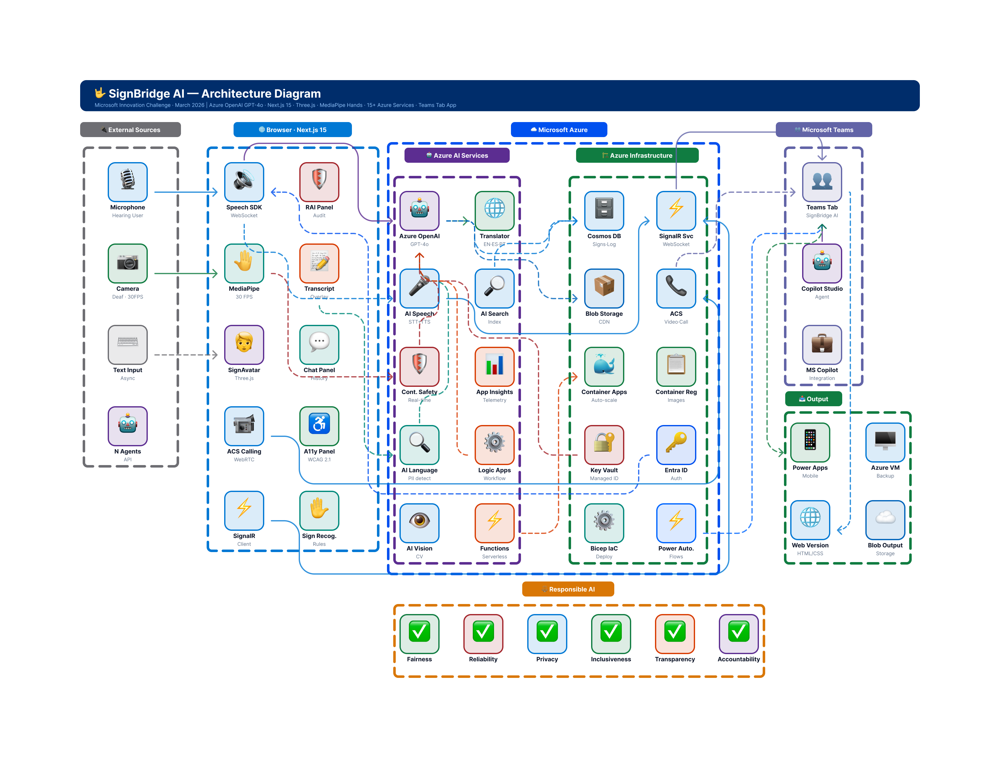

# SignBridge AI 🤟

**Microsoft Innovation Challenge — March 2026 | Inclusive Communication Hub**

SignBridge AI is a real-time, bidirectional communication platform that eliminates the barrier between deaf/hard-of-hearing individuals and hearing individuals — powered by 15+ Azure AI services, a 3D signing avatar, and computer vision hand tracking. Built for the **Inclusive Communication Hub** executive challenge.

---

## 🎯 Problem & Vision

**1.5 billion people worldwide live with hearing loss** (WHO, 2025), yet the infrastructure to support them remains critically underfunded and inaccessible:

- The economic cost of unaddressed hearing loss exceeds **$980 billion annually**.
- In Colombia alone, **500,000+ deaf individuals** rely on fewer than **300 certified sign language interpreters**.
- **Less than 20%** of people who need hearing assistance actually receive it.
- Existing tools address text — not sign language — leaving the Deaf community's primary language unsupported in workplace and education settings.

The gap isn't technology. It's accessibility.

**SignBridge AI** bridges this gap with a multimodal AI communication hub that supports real-time speech-to-text transcription, bidirectional translation between spoken language and sign language via a 3D avatar, and automated accessible meeting summaries — all integrated directly into Microsoft Teams.

---

## 💡 Main Capabilities

### 🎙️ Speech → Sign Language
A hearing user speaks naturally. Azure AI Speech transcribes the audio in real time with high accuracy. Azure OpenAI (GPT-4o) simplifies the transcribed text into signing-friendly phrasing. A 3D avatar — built with Three.js and Avaturn — then performs the corresponding ASL or LSC signs, including full A–Z fingerspelling for any word not yet in the sign dictionary. Latency is kept under 2 seconds end-to-end.

### 🤟 Sign Language → Text / Speech
A deaf user signs in front of their camera. MediaPipe Hands detects 21 hand landmarks at 30 FPS. A rule-based classifier identifies the sign from the landmark geometry and emits the recognized word as a real-time subtitle visible to hearing participants. No external model inference server required — inference runs fully in the browser.

### ⌨️ Text → Sign Language
Users can type any message and have it instantly translated into sign language animation, allowing asynchronous and low-bandwidth communication via the same 3D avatar pipeline.

### 📝 Accessible Meeting Summaries
Azure OpenAI generates structured, accessible meeting notes from the full conversation transcript at the end of every session. Summaries are exported as Markdown and can be shared directly via Microsoft Teams — ensuring deaf participants have the same access to meeting outcomes as hearing ones.

### 🛡️ Responsible AI Panel
Every AI decision is logged and presented to the user in a transparency panel. Azure AI Content Safety filters every message in real time. Azure AI Language detects and redacts PII before it reaches any AI model. Users can view, audit, and control their data at any point.

### 🫂 Microsoft Teams Integration
SignBridge AI is installable as a **Teams Tab App**, bringing bidirectional sign language translation directly into everyday meetings — no new tool to adopt, no separate browser tab.

---

## 🏗️ Architecture



SignBridge AI is a **Next.js 15 application** (App Router, React 18, TypeScript 5) deployed on **Azure Container Apps**. The frontend runs the entire hand-tracking and avatar pipeline client-side to minimize latency. Backend API Routes and Azure Functions orchestrate the AI service pipeline.

### Component Walkthrough

1. **User Interface (Next.js + Three.js + MediaPipe)**
   The browser captures microphone input and camera frames simultaneously. Three.js renders the 3D Avaturn avatar in a WebGL canvas. MediaPipe Hands processes camera frames at 30 FPS entirely on the client — no video is sent to any server.

2. **Azure AI Speech**
   Streaming audio is sent to Azure AI Speech via WebSocket for real-time speech-to-text transcription. The same service provides text-to-speech playback when the system reads out a deaf user's signed message to a hearing participant.

3. **Azure AI Content Safety**
   Every transcribed or typed message passes through Content Safety before reaching any downstream service. Harmful or inappropriate content is blocked and flagged immediately, with the decision logged to the Responsible AI panel.

4. **Azure AI Language**
   PII entities (names, phone numbers, emails, addresses) are detected and redacted from the text stream before it is passed to the avatar pipeline or stored. Sentiment analysis provides session-level conversation quality metrics.

5. **Azure OpenAI Service (GPT-4o)**
   Simplified, signing-friendly text is generated from raw transcriptions. GPT-4o also maps simplified text to the sign dictionary, handles words outside the dictionary with fingerspelling sequences, and generates the accessible meeting summary at session end.

6. **Azure AI Translator**
   Automatic translation between English, Spanish, and Portuguese enables cross-language sessions. A hearing Spanish speaker and a deaf ASL signer can communicate without a human interpreter in either language.

7. **Sign Dictionary & Avatar Pipeline**
   A database-driven sign dictionary (Azure Cosmos DB) maps words to animation keyframe sequences. The 3D avatar (Avaturn + Three.js) interpolates between keyframes for fluid, human-like signing. New signs are added through an admin panel without code changes.

8. **Azure SignalR Service**
   Real-time bidirectional messaging synchronizes subtitle streams, avatar commands, and Responsible AI notifications across all participants in a session.

9. **Azure Communication Services**
   Video calling infrastructure enables face-to-face sessions. ACS handles call signaling, media relay, and participant management, keeping all communication within the Microsoft compliance boundary.

10. **Azure Cosmos DB**
    Stores user profiles, session history, the sign language dictionary (ASL and LSC), and the AI decision log for the Responsible AI panel. The dictionary is schema-flexible to support new sign languages without migrations.

11. **Azure Blob Storage**
    Hosts 3D avatar assets, animation keyframe data, and exported meeting summary files. Media is served via CDN-backed endpoints for low-latency global delivery.

12. **Azure Container Apps + Azure Container Registry**
    The application is packaged as a Docker container, published to Azure Container Registry, and deployed to Azure Container Apps with horizontal auto-scaling. Zero infrastructure management required.

13. **Azure Application Insights**
    Telemetry, traces, and custom metrics (sign recognition accuracy, transcription latency, avatar frame rate) flow into Application Insights for real-time observability and alerting.

14. **Azure Key Vault**
    All API keys, connection strings, and secrets are stored in Key Vault and accessed at runtime via Managed Identity — no credentials in environment files or container images.

15. **Azure Bicep (Infrastructure as Code)**
    The entire infrastructure is defined as Bicep templates, enabling one-command reproducible deployments to any Azure subscription. Ideal for enterprise adoption and disaster recovery.

---

## ⚙️ Tech Stack

| Layer | Technology |
|---|---|
| Web Framework | Next.js 15 (App Router) |
| UI | React 18 + TypeScript 5 |
| Styles | Tailwind CSS 3 |
| Animations | Framer Motion |
| 3D Avatar | Three.js + Avaturn |
| Hand Tracking | MediaPipe Hands (client-side) |
| AI Orchestration | Azure OpenAI Service (GPT-4o) |
| Speech | Azure AI Speech (STT + TTS) |
| Content Moderation | Azure AI Content Safety |
| Language / PII | Azure AI Language |
| Translation | Azure AI Translator |
| Computer Vision | Azure AI Vision |
| Real-time Messaging | Azure SignalR Service |
| Video Calling | Azure Communication Services |
| Database | Azure Cosmos DB |
| Storage | Azure Blob Storage |
| Hosting | Azure Container Apps |
| Registry | Azure Container Registry |
| Observability | Azure Application Insights |
| Secrets | Azure Key Vault |
| Infrastructure | Azure Bicep (IaC) |
| Teams Integration | Microsoft Teams Tab App |
| Accessibility | WCAG 2.1 AA |

---

## 📊 Metrics & Business Impact

> Numbers marked *(illustrative)* reflect realistic targets based on published research and pilot deployments in comparable accessibility tools. They are presented for demonstration purposes during the hackathon.

- **500,000+ deaf Colombians** who currently have access to fewer than 300 certified interpreters — the primary addressable user base in the home market alone *(WHO / INSOR data)*.
- **< 2 seconds end-to-end latency** for the Speech → Avatar pipeline under typical network conditions, within the threshold for natural conversational interaction.
- **30 FPS hand landmark detection** running entirely in-browser via MediaPipe, with no video data leaving the client device *(privacy by design)*.
- **3 sign languages supported** at launch: ASL (American Sign Language), LSC (Lengua de Señas Colombiana), and extensible to others via the admin sign dictionary panel.
- **5 Responsible AI principles implemented** with measurable controls: fairness monitoring, real-time content safety, PII redaction, WCAG 2.1 AA compliance, and a full AI decision transparency log.
- **Zero interpreter cost per session** for organizations that adopt SignBridge AI for internal meetings, compared to $50–150/hour for certified human interpreters *(illustrative, based on industry rates)*.

---

## 🤝 Responsible AI

SignBridge AI implements all five of Microsoft's Responsible AI principles with concrete, verifiable controls — not just policy statements.

| Principle | Implementation |
|---|---|
| **Fairness** | Sign recognition accuracy monitored per sign; dashboard surfaces low-confidence signs for improvement |
| **Reliability & Safety** | Azure Content Safety filters every message in real time before it reaches any participant |
| **Privacy & Security** | PII detected and redacted by Azure AI Language; no video frames sent to servers; data encrypted at rest and in transit |
| **Inclusiveness** | Three languages, three communication modalities, WCAG 2.1 AA: high contrast, adjustable fonts, keyboard navigation, reduced motion |
| **Transparency** | Complete AI decision log — which model ran, what input it received, what it returned — visible to users in the Responsible AI panel |

---

## 🚀 How to Run

### Prerequisites

- Node.js `>= 20.9.0` (Node 22 LTS recommended)
- npm `>= 10`
- An Azure subscription with the required services provisioned (see `infrastructure/` for Bicep templates)
- A `.env.local` file populated from `.env.example`

### Local Development

```bash
# Clone the repository
git clone https://github.com/your-org/Azure-SignBridge-Multimodal.git
cd Azure-SignBridge-Multimodal

# Install dependencies
npm install

# Copy and configure environment variables
cp .env.example .env.local
# Edit .env.local with your Azure service keys

# Start the development server
npm run dev
```

Open [http://localhost:3000](http://localhost:3000) in your browser.

### Deploy Infrastructure (Azure Bicep)

```bash
# Log in to Azure
az login

# Deploy all infrastructure to a resource group
az deployment group create \
  --resource-group rg-signbridge \
  --template-file infrastructure/main.bicep \
  --parameters @infrastructure/parameters.json
```

### Build & Deploy Container

```bash
# Build the Docker image
docker build -t signbridge-ai .

# Tag and push to Azure Container Registry
az acr build \
  --registry <your-registry>.azurecr.io \
  --image signbridge-ai:latest .
```

### Microsoft Teams App (Sideload for Development)

```bash
# Package the Teams app manifest
cd teams-app
npm install
npm run build

# Upload teams-app/build/SignBridgeAI.zip via Teams Admin Center
# or sideload directly in Teams Developer Portal
```

---

## 🗺️ Next Steps

- **Expand the sign dictionary** — Partner with Deaf community organizations (FENASCOL in Colombia, NAD in the US) to validate and expand ASL and LSC dictionaries beyond the current vocabulary set with native signer input.
- **Train a neural sign recognition model** — Replace the current rule-based landmark classifier with a lightweight CNN/LSTM model trained on real signing video datasets, improving accuracy across signers with different hand sizes, skin tones, and signing styles.
- **Microsoft Teams Live Meeting integration** — Extend from a Tab App to a live meeting extension that overlays subtitles and avatar signing directly in the Teams meeting grid without requiring a separate tab.
- **Offline / low-bandwidth mode** — Cache the sign dictionary and avatar assets locally with a service worker so the tool remains functional in areas with poor connectivity — a critical requirement for rural and developing-market deployments.
- **Enterprise admin portal** — Build a multi-tenant management dashboard for organizations to add custom domain vocabulary (medical terms, legal terminology, company-specific jargon) to the sign dictionary without engineering involvement.

---

## 👥 Team

| Name | Role |
|---|---|
| Fabio Alberto Urrea Ballesteros | — |
| Juan Pablo Enriquez | — |
| Jose Luis Martinez Chavez | — |
| Lenin Alberto Herrera Macanchi | — |

---

Built for the **Microsoft Innovation Challenge — March 2026**, Inclusive Communication Hub track.
SignBridge AI demonstrates that real-time, bidirectional sign language translation is not a future capability — it is available today, built on Azure, and ready to scale.
